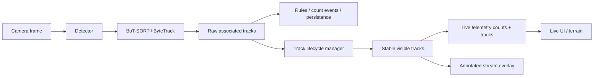

# Authoritative Live Track Lifecycle Design

Date: 2026-05-09

## Goal

Make live video overlays and telemetry counts stable enough for real operational
use. A plainly visible object must not cause the Live page to alternate between
`1 visible now` and `0 visible now` because a single detector frame missed it.

The home lab/iMac feed is the fast validation case, not the design ceiling. The
system must be shaped for crowded and visually difficult scenes: partial
occlusion, people crossing, similar-looking objects, vegetation, poles/fences,
glare, and short detector dropouts.

This replaces the current frontend-only anti-flap behavior with an authoritative
backend track lifecycle that drives both:

- the annotated stream overlay
- the live telemetry frame published to the UI

The existing Telemetry Terrain and frontend hold logic remain useful as display
polish and stale-frame protection, but the backend becomes the source of truth
for live identity continuity.

## Current Root Cause

The current implementation has two independent visual sources:

- backend `annotated-whip` draws raw tracker output on the video frame
- frontend telemetry stabilization holds recent tracks after telemetry gaps

That helped the UI, but it cannot solve the real product target because backend
telemetry still publishes raw latest-frame `counts` and raw latest-frame tracks.
When the detector/tracker misses a person for one frame, the backend can publish
`counts={}` even though the person is still in the scene.

The right fix is to define object visibility as a lifecycle state, not as "was
detected on this exact frame."

## Product Requirement

For Live:

- `visible now` counts active and short coasting tracks.
- The annotated stream and telemetry must agree on the same stable track set.
- A one-frame or short multi-frame miss must not drop counts to zero.
- A false duplicate track for the same person should be suppressed before it
  reaches telemetry or the annotated overlay.
- Coasting state must be visible in metadata so the UI can show uncertainty
  without claiming a fresh detector hit.
- The lifecycle model must support both simple lab scenes and difficult
  production scenes without changing the telemetry contract.

For analytics:

- Rules, count-event processing, and raw tracking persistence must continue to
  use detector-associated tracks by default.
- Coasting tracks are for live operator continuity unless a future analytics
  feature explicitly opts into them.

## Scene Difficulty Targets

This implementation should make the first two tiers work immediately and leave a
clean profile path for the third:

| Tier | Scene | Expected behavior |
|---|---|---|
| Lab / simple | One or a few objects, slow movement, fixed camera | No count flicker or box blinking during short misses. |
| Crowded / obstructed | People crossing, short partial occlusion, poles/furniture/vegetation | Stable IDs survive short occlusions, duplicate boxes are suppressed, coasting is visible but bounded. |
| Severe / long occlusion | Dense crowds, long full occlusion, similar clothing, heavy vegetation | Requires an appearance-aware profile such as BoT-SORT ReID, DeepSORT/NvDCF-style visual tracking, or a future DeepStream lane on capable hardware. |

The patch should not pretend lifecycle prediction can solve long full occlusion
alone. The design goal is to make the efficient baseline robust now and expose
the right extension points for appearance-aware tracking where the scene demands
it.

## Best-Practice Basis

Modern efficient MOT systems combine per-frame detection, tracker association,
and target lifecycle management:

- Ultralytics tracking supports BoT-SORT and ByteTrack, with tunable thresholds,
  `track_buffer`, matching thresholds, global motion compensation, and optional
  ReID for occlusion-heavy scenes.
- ByteTrack's core contribution is preserving tracks through low-confidence
  detector boxes instead of discarding them too early.
- NVIDIA DeepStream's tracker model uses late activation and shadow tracking:
  new targets are tentative, active targets can become inactive when unmatched,
  and `maxShadowTrackingAge` controls how long they remain recoverable.
- DeepStream recommends more visual/appearance-aware tracking such as NvDCF or
  DeepSORT/ReID for complex scenes with occlusion, while noting the compute
  tradeoff.

References:

- Ultralytics tracking docs: https://github.com/ultralytics/ultralytics/blob/main/docs/en/modes/track.md
- ByteTrack ECCV 2022: https://www.ecva.net/papers/eccv_2022/papers_ECCV/html/315_ECCV_2022_paper.php
- NVIDIA DeepStream Gst-nvtracker docs: https://docs.nvidia.com/metropolis/deepstream/dev-guide/text/DS_plugin_gst-nvtracker.html

## Proposed Architecture

Add a backend lifecycle layer after tracker association and before live
telemetry/annotation:

The lifecycle manager owns stable identity and publication state:

| State | Published? | Counted in Live? | Meaning |
|---|---:|---:|---|
| `tentative` | No | No | New unmatched candidate not yet trusted. |
| `active` | Yes | Yes | Associated with a tracker output on this frame. |
| `coasting` | Yes | Yes | Recently active, temporarily unmatched, bbox predicted/held. |
| `lost` | No | No | Expired beyond the coasting TTL. |

The frontend should treat `active` as fresh and `coasting` as visible but
uncertain. It should not produce its own duplicate overlay on `annotated-whip`
once the backend annotates the stable lifecycle tracks.

## Lifecycle Behavior

Default configuration:

- `coast_ttl_ms = 2500`
- `tentative_hits = 2`
- `instant_activation_confidence = 0.75`
- `duplicate_iou_threshold = 0.60`
- `reassociate_iou_threshold = 0.35`
- `reassociate_center_distance_ratio = 0.45`
- `velocity_damping = 0.70`

Update rules:

1. Match tracker detections to existing lifecycle tracks by raw source track id
   when possible.
2. If raw tracker id changes, re-associate same-class tracks by IoU and center
   distance before creating a new stable identity.
3. Suppress duplicate same-class tracks when boxes strongly overlap. Prefer the
   older active stable track unless the new track is clearly better.
4. Promote a tentative track after two hits, or immediately when confidence is
   high and it does not duplicate an active/coasting track.
5. Move missing active tracks to `coasting` for the TTL.
6. Predict coasting boxes with damped constant velocity when prior motion exists;
   otherwise hold the last bbox.
7. Expire tracks after the TTL and remove them from live telemetry.

## Telemetry Contract

Add optional/defaulted fields to `TelemetryTrack`:

- `stable_track_id: int | null`
- `track_state: "active" | "coasting"`
- `last_seen_age_ms: int`
- `source_track_id: int | null`

Published `track_id` should become the stable lifecycle id for live telemetry.
The raw tracker id remains available as `source_track_id`.

`TelemetryFrame.counts` should represent stabilized live visibility:

- active tracks count
- coasting tracks count until TTL expiry
- tentative/lost tracks do not count

If future consumers need raw detector-only counts, add a separate optional
`detected_counts` field. For this implementation, rules, count events, and local
tracking persistence continue to receive the raw associated tracks directly from
the engine before lifecycle smoothing.

## Annotated Stream Overlay

`annotated-whip` should draw stable lifecycle tracks, not raw latest detections.

Visual treatment:

- active: solid class-colored box
- coasting: dashed/subdued class-colored box
- label: class name only for active; class name plus subtle `held`/age treatment
  for coasting
- no raw tracker id text

Privacy filtering still uses raw detections so faces/plates are blurred even if
the lifecycle suppresses a telemetry duplicate.

## Tracker Strategy

Efficient default:

- keep the existing Ultralytics adapter
- keep low-score association enabled through tuned ByteTrack/BoT-SORT thresholds
- add lifecycle shadow/coasting and duplicate suppression around it

Difficult-scene profile:

- retain BoT-SORT as the default selectable tracker for crowded scenes
- keep ReID optional rather than always-on, because it adds model/runtime cost
- expose the lifecycle manager and tracker configuration so a camera/runtime can
  choose an efficient profile or a difficult-scene profile
- make the difficult-scene path explicit: BoT-SORT with ReID where model support
  is available, or a future DeepStream/NvDCF-style visual tracker on capable
  edge hardware
- keep the telemetry contract identical across profiles so the frontend does not
  care whether continuity came from ByteTrack, BoT-SORT, ReID, or visual tracking

This gives immediate stability without reopening Jetson/TensorRT/RTSP work.

## Testing Requirements

Backend unit tests:

- missing track remains `coasting` and counted during TTL
- missing track expires after TTL
- new duplicate overlapping same-class track is suppressed
- raw tracker id switch reuses the stable lifecycle id
- tentative low-confidence single-frame false positive is not published
- crossing/overlapping same-class detections do not create two published tracks
  for the same object

Engine tests:

- telemetry counts stay at `{"person": 1}` through a one-frame miss
- published telemetry includes `track_state="coasting"` and `last_seen_age_ms`
- rules/count events receive raw active tracks, not coasting tracks
- annotated stream draws stable lifecycle tracks
- tracker change resets lifecycle state

Frontend tests:

- generated API includes lifecycle fields
- frontend maps `track_state="coasting"` to held visual state
- frontend does not draw duplicate canvas overlays for `annotated-whip`
- visible copy uses stabilized total so it does not flash to `0 visible now`

## Out Of Scope

- WebGL.
- Reopening Jetson/TensorRT/RTSP optimization.
- Training a new detector.
- ReID model deployment in this patch.
- New incident/rule semantics for coasting tracks.
