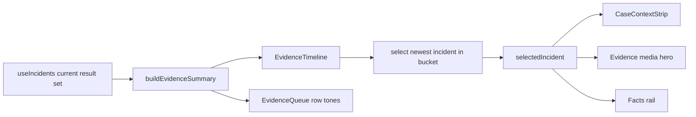

# Evidence Desk Timeline And Case Context Design

Date: 2026-05-09

## Goal

Polish the Evidence Desk so it reads as an investigation and decision surface, not a generic analytics page. The work changes the graph language and surrounding UI so operators can answer:

- What happened and when?
- Is this event part of a pattern?
- What evidence is available?
- What still needs review?

This is frontend-only. It does not add backend endpoints, change incident persistence, change review mutation behavior, alter storage signing, or add detector logic.

## Product Framing

The positioning report frames Vezor as a sovereign spatial intelligence platform that turns existing cameras into live awareness, evidence, patterns, and fleet control. The current Evidence Desk already supports the right workflow: queue, selected media, facts, and review action. The gap is presentation. It feels like a list of records plus a media panel, when it should feel like a case review desk.

The polished Evidence Desk should communicate:

> "These are secured scene events. Here is the pattern, the selected case, the evidence available, and the review state."

## Current Problems

### No Evidence-Level Time Surface

The page currently lists incidents but does not show event distribution over time. Operators cannot quickly see whether the selected event is isolated or part of a burst.

### Queue Rows Are Text-Heavy

The queue has camera name, type, timestamp, and review status. It works, but event type, evidence completeness, and selection state do not read as strong operational signals.

### Case Header Is Too Thin

The media hero header says camera, event type, timestamp, and review status. It does not make evidence completeness, retention/storage, or chain-of-custody state obvious.

### Raw Payload Competes With Decision Facts

The facts rail includes useful metadata, but raw payload rows can dominate the panel. The page should separate decision facts from raw payload details.

## Approved Direction

Use an **Evidence Timeline** and **Case Context Strip** rather than generic charts.

Recommended graph types:

- Evidence timeline density strip: event counts over the current result set.
- Selected-event marker: highlights where the selected case sits in the timeline.
- Compact status mix: pending and reviewed counts per bucket.
- Type-colored queue accents: event type colors consistent with Live object colors.

Avoid:

- pie charts
- donut charts
- radar charts
- decorative chart backgrounds
- large BI dashboards inside Evidence Desk

## Functional Requirements

### 1. Evidence Signal Model

Add a small frontend utility that derives evidence presentation state from the incidents already loaded by `useIncidents`.

It must derive:

- deterministic color/tone by incident type
- evidence completeness:
  - `Snapshot and clip`
  - `Clip only`
  - `Snapshot only`
  - `Metadata only`
- review totals:
  - pending count
  - reviewed count
  - total count
- storage total
- type rows sorted by count
- timeline buckets from the currently loaded incident set

No backend changes are required. The page already receives enough data for this pass.

### 2. Event Type Colors

Use class-family colors consistent with the Live signal direction:

| Family | Incident examples | Color |
|---|---|---|
| Human | `person`, `occupancy`, `queue` | green `#61e6a6` |
| Vehicle | `vehicle`, `car`, `truck`, `forklift`, `parking` | blue `#62a6ff` |
| Safety | `ppe`, `helmet`, `vest`, `hard_hat`, `safety` | amber `#f7c56b` |
| Alert | `zone`, `access`, `perimeter`, `violation`, `intrusion` | pink `#ff6f9d` |
| Other | all other incident types | deterministic cyan/violet rotation |

The color is a visual hint, not a severity promise.

### 3. Evidence Timeline

Add a full-width timeline surface between the filters and the three-column desk layout.

Behavior:

- Uses the currently loaded incidents after filters.
- Buckets incidents into up to 12 chronological buckets.
- Shows a compact density shape with pending/reviewed split.
- Highlights the bucket containing the selected incident.
- Lets the operator select a bucket; selecting a bucket selects the newest incident in that bucket.
- Uses accessible button labels such as `Select evidence bucket 18 Apr 10:00, 3 records`.
- Handles a single timestamp without division-by-zero or layout collapse.
- Handles empty results with the same footprint as the loaded state.

Visual direction:

- Dark, restrained, and information-dense.
- A low gradient terrain or stacked bar strip, not a tall chart.
- Height target: 88-120px on desktop.
- No continuous animation.
- Selected bucket should glow or sharpen subtly.

### 4. Case Context Strip

Add a compact strip inside the selected media hero, above the image/clip placeholder.

It should contain four cells:

1. Trigger
   - incident type
   - event color accent
2. Evidence
   - completeness label
   - snapshot/clip availability
3. Review
   - pending/reviewed status
   - reviewed actor/time when available
4. Retention
   - secured storage label
   - `No clip storage` when storage is zero

The strip should support quick case review without opening the facts rail.

### 5. Queue Polish

Improve queue rows without changing the queue workflow.

Requirements:

- Add a left color rail or dot derived from incident type.
- Keep camera name as the primary row label.
- Keep event type and time visible.
- Add evidence completeness as a small secondary chip.
- Keep review status visible but visually quieter than selection.
- Selected row should feel connected to the timeline and hero.

### 6. Facts Rail Polish

Separate decision facts from raw payload details.

Requirements:

- Keep the existing facts rail.
- Rename the lower raw payload area to `Raw payload`.
- Wrap raw payload in a collapsed-by-default disclosure if the payload has more than four keys.
- Keep payload inspectable for QA and debugging.
- Do not hide core facts such as scene, timestamp, review status, reviewed by, or storage.

### 7. Copy Requirements

Use product language that matches the positioning report:

- `Evidence timeline`
- `Case context`
- `Secured evidence`
- `Review queue`
- `Raw payload`
- `Pending review`
- `Reviewed`

Avoid copy that sounds like a broken system when evidence is usable:

- avoid `missing media` as the primary label
- prefer `Metadata only` or `Clip only`

### 8. Responsive And Accessibility Rules

- Timeline remains full width above the desk grid.
- On mobile, the order is: filters, timeline, queue, selected evidence, facts.
- All bucket interactions are keyboard-accessible buttons.
- Timeline includes an `aria-label`.
- Do not rely on color alone; bucket labels and counts must be available to assistive tech.
- Respect reduced motion.
- No WebGL.
- No nested cards inside cards.
- Text must not overlap at 375px, 768px, 1024px, and 1440px widths.

## Architecture

### New Utility

Create:

`frontend/src/lib/evidence-signals.ts`

Responsibilities:

- event tone mapping
- evidence completeness derivation
- timeline bucket derivation
- summary totals
- selected bucket lookup

This file must be pure and unit tested.

### New Components

Create:

`frontend/src/components/evidence/EvidenceTimeline.tsx`

Responsibilities:

- render derived timeline buckets
- expose bucket selection callbacks
- show selected bucket state
- keep chart footprint stable

Create:

`frontend/src/components/evidence/CaseContextStrip.tsx`

Responsibilities:

- render trigger/evidence/review/retention context for the selected incident
- use evidence signal utility labels and tones

Create:

`frontend/src/components/evidence/EvidenceQueue.tsx`

Responsibilities:

- move the current queue markup out of `Incidents.tsx`
- add type color accents and evidence completeness chips
- preserve the existing selection behavior

### Updated Page

`frontend/src/pages/Incidents.tsx`

Responsibilities:

- derive evidence summary from loaded incidents
- render `EvidenceTimeline` between filters and desk grid
- use the extracted `EvidenceQueue`
- render `CaseContextStrip` inside `IncidentEvidenceHero`
- keep existing review mutation and filters unchanged

## Data Flow

## Testing Requirements

Unit tests:

- `evidence-signals.test.ts`
  - derives evidence completeness labels
  - maps incident types to deterministic tones
  - builds stable timeline buckets
  - marks the selected bucket
  - handles single timestamp and empty input

- `EvidenceTimeline.test.tsx`
  - renders bucket buttons and counts
  - calls `onSelectIncident` with the newest incident in a clicked bucket
  - renders empty state

- `CaseContextStrip.test.tsx`
  - renders trigger, evidence, review, and retention cells
  - shows reviewed actor/time when available

- `EvidenceQueue.test.tsx`
  - renders event type tone accents
  - renders completeness chips
  - preserves selected row and click behavior

Integration tests:

- `Incidents.test.tsx`
  - renders timeline, queue, media, and facts together
  - selecting a timeline bucket changes the selected evidence
  - evidence hero shows case context
  - existing review mutation behavior still works

Browser/visual QA:

- Verify `/incidents` at desktop and mobile widths.
- Verify timeline text does not overlap.
- Verify selected queue row, selected timeline bucket, and hero context feel connected.

## Out Of Scope

- Backend time-range filtering.
- Backend aggregation endpoints.
- New incident severity schema.
- Chain-of-custody audit endpoints.
- Export workflows.
- Natural-language evidence search.
- WebGL or animated chart libraries.

## Locked Decisions

- Evidence Desk gets a timeline density strip, not a BI chart.
- Bucket click selects the newest incident in that bucket.
- Case context lives inside the media hero above the media.
- Queue polish stays within the current review workflow.
- The first pass uses only existing incident fields.
