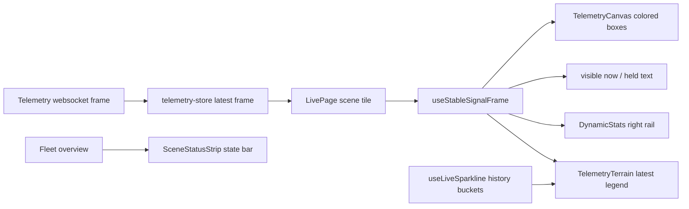

# Live Signal Terrain And Stability Design

Date: 2026-05-09

## Goal

Make the Live scene card feel like a stable, premium operational intelligence surface instead of a raw per-frame debug view. The work covers four user-visible changes:

- Stabilize live object boxes, counts, and right-rail signal rows so they do not flap on single missed frames.
- Color object boxes by class with a consistent palette.
- Replace the thin sparkline list under each video with the approved **Telemetry Terrain** gradient area surface.
- Redesign the legends above the video into a calmer scene-state bar with clearer language.

This is frontend-only. It does not change detector thresholds, tracker behavior, telemetry publication, WebRTC/HLS transport, backend APIs, or runtime metrics.

## Product Framing

The current Live view is on-position for Vezor: video-first, dark, operational, and visibly aware of deployment posture. The weakness is trust. If a person is plainly visible while the UI says `0 visible now`, or if the right rail appears and disappears every frame, the product feels nervous. A sovereign spatial intelligence UI should communicate uncertainty without jitter.

The new behavior should feel like:

> "The scene is live. Signals are being interpreted. When tracking drops momentarily, the UI shows recent signal continuity instead of blinking."

## Current Problems

### Raw Latest-Frame Rendering

`LivePage` currently derives:

- object boxes from `TelemetryCanvas(frame)`
- `visible now` from `frame.counts`
- right rail rows from aggregate `frame.counts`
- bottom sparkline values from live history plus latest telemetry

When the latest frame alternates between `{ person: 1 }` and `{}`, all four surfaces flap together.

### Diagnostic-Led Legend Language

The top chip stack is accurate but too noisy:

- `Direct stream unavailable: privacy filtering required` reads as if the live view is broken, even when WebRTC is live.
- `Worker not reported` feels like a fault when the scene may simply be in manual/local development mode.
- Several uppercase badges compete with the video.

### Thin Line Chart Under Video

The current `LiveSparkline` rows are useful but visually weak. They look like a small embedded chart rather than a signature OmniSight live signal surface.

## Approved Direction

Use visual option **B: Telemetry Terrain**.

The scene card keeps video as the hero. Beneath the video, the card renders a soft gradient area field that summarizes recent signal intensity. It should be compact, readable, and atmospheric without becoming decorative. This is still a utility surface, not a marketing visual.

## Functional Requirements

### 1. Live Signal Stabilization

Add a small frontend signal-stabilization layer between `framesByCamera` and live UI rendering.

For each camera:

- Live tracks are keyed by `class_name + track_id`.
- When a track appears in the latest telemetry frame, it is `live`.
- When a previously live track is absent from the latest frame, keep it as `held` for a short hold window.
- Default hold window: `1200ms`.
- Held tracks render visibly but subdued: lower alpha, dashed border, and `last seen` label treatment.
- Expired held tracks disappear after the hold window.
- Counts used by `visible now`, `DynamicStats`, and class chips are derived from stabilized tracks, not raw latest-frame counts.

The UI must not claim stale detections are live. It should distinguish:

- `live`: present in latest telemetry frame.
- `held`: recently seen within the hold window.

Recommended copy:

- `1 visible now` for live count.
- `1 signal held` when only held tracks remain.
- `person held 0.8s` in secondary/tooltip text if exposed.

### 2. Class-Colored Object Boxes

Object overlays should use stable colors by semantic class family.

Suggested palette:

| Class family | Examples | Color |
|---|---|---|
| Human | `person`, `worker`, `hi_vis_worker` | green `#61e6a6` |
| Vehicle | `car`, `truck`, `bus`, `motorcycle`, `bicycle` | blue `#62a6ff` |
| Safety / PPE | `helmet`, `vest`, `ppe`, `hard_hat` | amber `#f7c56b` |
| Alert / violation | rule/event overlays in a future rules pass | pink `#ff6f9d` |
| Other classes | fallback deterministic palette | cyan/purple rotation |

The color mapping must be deterministic and shared between:

- `TelemetryCanvas`
- `TelemetryTerrain`
- right rail signal rows

### 3. Telemetry Terrain

Replace `LiveSparkline` in the scene card with a new `TelemetryTerrain` component.

Behavior:

- Uses existing `useLiveSparkline(cameraId)` data for history buckets.
- Renders one primary gradient area for the strongest current/recent class.
- Renders up to two secondary signal traces as subtle colored lines or chips.
- Shows a compact legend with current class states.
- Shows latest stabilized counts beside class labels.
- Uses accessible labels and test IDs.
- Handles loading and error states with the same footprint as the loaded component.

Visual direction:

- Dark panel inside the card, not another card nested inside a card.
- Low, soft gradient surface, around `72-96px` high on desktop.
- No animated chart drawing by default.
- If a future iteration adds motion, it must respect reduced motion.

Preferred labels:

- `Telemetry terrain`
- `person active`
- `vehicle quiet`
- `held 1.2s`

### 4. Scene State Bar Above Video

Replace the current dense `SceneStatusStrip` chip stack with a clearer scene-state bar.

The state bar should separate three types of information:

1. **Primary live status**
   - `Telemetry live`, `Telemetry stale`, or `Awaiting telemetry`.
   - Tone should remain prominent.

2. **Stream path**
   - Use language that explains browser delivery accurately.
   - If native passthrough is unavailable but processed WebRTC is live, show:
     - `Processed stream live`
     - secondary: `Native passthrough gated: privacy filtering required`
   - Avoid the phrase `Direct stream unavailable` on Live unless no viewer stream can be displayed.

3. **Operational posture**
   - Mode and worker state, but quieter than primary live status.
   - Prefer `Central`, `Edge`, `Hybrid`, `Manual worker`, `Worker running`, `Worker stale`.
   - Avoid `Worker not reported` as a prominent warning on Live. If needed, use `Worker unmanaged` or `Worker awaiting report`.

The top of the card should read more like a dashboard summary than a diagnostic dump.

### 5. Right Rail Stability

`DynamicStats` should use stabilized counts and held states.

Requirements:

- Rows should not disappear immediately on a one-frame miss.
- Live rows sort above held rows.
- Held rows are dimmed and labeled `held`.
- Zero-count class rows should still be allowed if they are within the hold window.
- The empty state appears only when there are no live or held signals.

### 6. Visual And Accessibility Rules

- No WebGL.
- No continuous animation.
- Do not use decorative orbs or unrelated background blobs.
- Do not use nested cards inside the scene card.
- Do not make the palette one-note; the terrain can use blue/green/amber accents but the page must remain operational, not decorative.
- Text must not overlap at desktop or mobile widths.
- Canvas overlay must remain `aria-label="Telemetry overlay"`.
- Terrain must have a meaningful label for screen readers, such as `aria-label="North Gate telemetry terrain"`.

## Architecture

### New Shared Utility

Create a focused live-signal utility:

`frontend/src/lib/live-signal-stability.ts`

Responsibilities:

- track key creation
- class color mapping
- live/held state derivation
- stable counts derivation
- terrain series ranking helpers

This utility must be pure and unit tested.

### New Hook

Create:

`frontend/src/hooks/use-stable-signal-frame.ts`

Responsibilities:

- keep previous signal state per scene tile
- update signal state when telemetry frames arrive
- advance held-track age on a small interval while held tracks exist
- return stable tracks, live counts, held counts, and display totals

The hook keeps time-based state out of `LivePage`.

### Updated Components

`TelemetryCanvas`

- Accept stable tracks.
- Draw colored boxes and labels.
- Draw held boxes with dashed/subdued treatment.

`TelemetryTerrain`

- New component replacing `LiveSparkline` in `LivePage`.
- Uses `useLiveSparkline` for historical buckets and stable counts for latest live/held display.

`DynamicStats`

- Accept stable signal rows or counts with held metadata.
- Keep rows stable during hold window.

`SceneStatusStrip`

- Render the redesigned scene-state bar.
- Keep the same component name unless implementation shows a clean reason to rename. This limits churn.

`LivePage`

- Compute one stable signal snapshot per scene tile.
- Use stabilized counts for:
  - `TelemetryCanvas`
  - `visible now`
  - `DynamicStats`
  - `TelemetryTerrain`

## Data Flow

## Testing Requirements

Unit tests:

- `live-signal-stability.test.ts`
  - keeps missing tracks as held inside hold window
  - expires held tracks after hold window
  - maps class colors deterministically
  - derives live and held counts

- `use-stable-signal-frame.test.tsx`
  - updates live tracks on new frames
  - preserves held tracks after a missed frame
  - expires held tracks after timers advance

- `TelemetryCanvas.test.tsx`
  - draws class-colored boxes
  - uses dashed/subdued treatment for held tracks
  - still filters active classes

- `TelemetryTerrain.test.tsx`
  - renders gradient terrain with top classes
  - uses stable latest counts
  - shows held state labels
  - handles loading/error

- `DynamicStats.test.tsx`
  - keeps held rows visible
  - only shows empty state when no live or held rows exist

- `SceneStatusStrip.test.tsx`
  - renders clearer primary/secondary state language
  - does not show `Direct stream unavailable` for a processed live stream path

Integration tests:

- `Live.test.tsx`
  - after a live `person` frame followed by an empty frame, the UI keeps the signal visible as held.
  - `visible now` text does not immediately drop to `0 visible now`.
  - the right rail does not disappear immediately.
  - bottom surface uses `Telemetry terrain` instead of `live-sparkline`.

Browser/visual QA:

- Verify `/live` at desktop width with mocked or real telemetry.
- Verify no text overlap in the scene state bar.
- Verify colored boxes are visible over bright and dark video areas.

## Out Of Scope

- Backend detector/tracker tuning.
- Changing TensorRT, RTSP/GStreamer, stream relay, telemetry queueing, or persistence.
- WebGL.
- Rules/incident overlays on boxes.
- New backend endpoints.
- Model confidence tuning.

## Open Decisions Locked For Implementation

- Hold window starts at `1200ms`.
- Terrain replaces the existing line list in scene cards.
- The right rail uses stabilized counts.
- The class color palette is frontend-only for now.
- Scene-state language should reduce diagnostic alarm and clarify processed stream availability.
