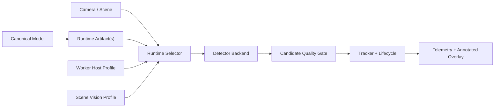

# Jetson Optimized Runtime Artifacts And Open-Vocab Design

Date: 2026-05-10

## Status

Track A and Track B were implemented on
`codex/omnisight-ui-spec-implementation` through the runtime artifact service,
worker runtime selection, TensorRT `.engine` detector path, compiled scene
open-vocab artifact build/selection, UI runtime artifact status, hardened
artifact validation, and model loading/configuration docs.

Track C remains future work. Do not implement DeepStream/NvDCF/NvDeepSORT until
the A/B runtime artifact lane has passed real Jetson soak validation.

This spec covers three tracks:

- **A. Fixed-vocab Jetson optimization**: turn the current ONNX Runtime Jetson
  acceleration path into a validated TensorRT artifact path.
- **B. Open-vocab optimized deployment**: keep dynamic `.pt` open vocab for
  exploration, and add compiled per-scene open-vocab artifacts for production
  monitoring.
- **C. Advanced Jetson tracking**: define the later DeepStream/NvDCF/NvDeepSORT
  lane for crowded and occluded scenes.

Implementation landed **A and B first**. Track C is specified so the schema,
runtime selection model, and Operations vocabulary do not paint us into a
corner, but it is not part of the current next implementation stage.

## Short Answer On Per-Scene Compile Cost

Per-scene compilation is the right production approach when the vocabulary is
stable enough to monitor. It is not the right path for every ad hoc query.

Expected operator experience:

| Operation | Typical expectation | UX treatment |
|---|---:|---|
| YOLOE prompt setup in `.pt` runtime | seconds | interactive/lab use |
| YOLOE export to ONNX after `set_classes(...)` | tens of seconds to a few minutes | background build |
| TensorRT FP16 engine build on Jetson Orin Nano Super | several minutes for nano/small models, longer for medium/large | background build with progress/status |
| TensorRT INT8 build with calibration | longer because calibration data is required | explicit advanced optimization |

Those numbers are estimates, not acceptance criteria. The implementation must
record real build duration, validation duration, host profile, TensorRT version,
model size, precision, and artifact size so operators can see actual results for
their device.

The product rule is:

- dynamic `.pt` open vocab is for discovery, demos, and fast vocabulary changes
- compiled open vocab is for a saved scene profile and a stable vocabulary
- compiled artifacts are cached by source model hash, vocabulary hash, input
  shape, precision, and target profile
- changing scene vocabulary invalidates the compiled scene artifact and falls
  back to `.pt` or a previous valid artifact until a new one validates

## Current State

Fixed-vocab detection still uses portable ONNX model rows as canonical camera
choices. Runtime provider selection can classify a Linux ARM64 NVIDIA host as
`linux-aarch64-nvidia-jetson` and prefer:

1. `TensorrtExecutionProvider`
2. `CUDAExecutionProvider`
3. `CPUExecutionProvider`

The Jetson handoff already recorded healthy ONNX Runtime TensorRT-provider
inference with `detect_session` around 9-10 ms. Track A/B then added the
target-specific runtime artifact lane:

- persistent `model_runtime_artifacts`
- model-scoped fixed-vocab TensorRT `.engine` artifacts
- scene-scoped compiled open-vocab artifacts keyed by camera and vocabulary hash
- worker runtime artifact selection and fallback to canonical ONNX or dynamic `.pt`
- Operations/camera setup visibility for valid, stale, and fallback states
- CLI support for registering fixed-vocab artifacts and building/registering
  YOLOE scene artifacts

Open-vocab detection still uses an Ultralytics-backed `.pt` path for discovery
and live vocabulary changes. Stable scene vocabularies can now be compiled and
selected as scene-scoped artifacts when the vocabulary hash and target profile
match.

## Product Goals

1. Make fixed-vocab Jetson inference production-grade:
   - canonical model remains ONNX
   - target-specific TensorRT artifacts are attached to that model
   - worker uses a valid artifact only on a compatible host
   - fallback to ONNX Runtime is explicit and visible
2. Make open vocab a real optimized option:
   - dynamic `.pt` stays available for discovery
   - saved scene vocabularies can be compiled into ONNX and TensorRT artifacts
   - compiled artifacts are scene-scoped and vocabulary-hash-scoped
   - worker uses compiled artifacts when valid
3. Keep the camera setup experience simple:
   - operators select a model and scene profile
   - Vezor selects the best runtime artifact for the worker
   - advanced artifact details live in Operations/model inventory
4. Prepare the advanced Jetson tracker lane:
   - DeepStream/NvDCF/NvDeepSORT can become a runtime backend later
   - current Python tracker remains the portable fallback
5. Preserve the authoritative backend track lifecycle:
   - runtime backend changes must not change telemetry semantics
   - annotated overlay and telemetry still come from the same stabilized track
     state

## Non-Goals

- No automatic internet model download.
- No training pipeline.
- No cloud artifact registry.
- No hidden inline compile during camera Save.
- No requirement that open-vocab queries compile before answering.
- No DeepStream implementation in A/B.
- No WebGL work.
- No reopening RTSP debugging unless fresh logs prove it is necessary.

## Definitions

### Canonical Model

A `Model` row selected by a camera. For fixed-vocab production this is an ONNX
model. For dynamic open vocab this is a `.pt` YOLOE or YOLO-World model.

### Runtime Artifact

A validated target-specific artifact attached to a model or scene. Examples:

- TensorRT `.engine` built from `yolo26n.onnx` for
  `linux-aarch64-nvidia-jetson`
- ONNX export built from `yoloe-26n-seg.pt` after applying scene vocabulary
- TensorRT `.engine` built from that compiled open-vocab ONNX export

### Model-Scoped Artifact

An artifact that applies to all cameras using a canonical fixed-vocab model.

### Scene-Scoped Artifact

An artifact that applies to one camera/scene because it includes a scene
vocabulary or scene-specific compile state.

### Dynamic Open Vocab

The current `.pt` runtime path. The worker can update vocabulary at runtime via
`set_classes(...)` without rebuilding an artifact.

### Compiled Open Vocab

YOLOE with a specific vocabulary applied before export. The exported model is no
longer a general dynamic vocabulary endpoint; it is an optimized detector for
that scene vocabulary.

## Architecture



Runtime selection happens at worker startup and when a relevant worker command
changes model or runtime vocabulary:

1. Fetch worker config.
2. Classify host profile.
3. Resolve candidate artifacts from worker config.
4. Prefer valid TensorRT engine for exact target profile, vocabulary hash, input
   shape, and precision.
5. Fall back to valid ONNX artifact.
6. Fall back to canonical ONNX or dynamic `.pt`.
7. Emit a structured runtime selection event with selected backend and fallback
   reason.

## Track A: Fixed-Vocab Jetson Optimization

### A1. Runtime Artifact Persistence

Add `model_runtime_artifacts` with:

- `id`
- `model_id`
- `camera_id nullable`
- `scope`: `model` or `scene`
- `kind`: `onnx_export` or `tensorrt_engine`
- `capability`: `fixed_vocab` or `open_vocab`
- `runtime_backend`: `onnxruntime`, `ultralytics_yoloe`, `ultralytics_yolo_world`,
  or `tensorrt_engine`
- `path`
- `target_profile`
- `precision`: `fp32`, `fp16`, or `int8`
- `input_shape`
- `classes`
- `vocabulary_hash nullable`
- `vocabulary_version nullable`
- `source_model_sha256`
- `sha256`
- `size_bytes`
- `builder`
- `runtime_versions`
- `validation_status`: `unvalidated`, `valid`, `invalid`, `stale`,
  `missing_artifact`, `target_mismatch`
- `validation_error`
- `build_duration_seconds nullable`
- `validation_duration_seconds nullable`
- `created_at`
- `updated_at`
- `validated_at nullable`

Invariant:

- model-scoped fixed-vocab TensorRT artifacts require `camera_id=null`,
  `capability=fixed_vocab`, and source model format ONNX
- scene-scoped open-vocab artifacts require `camera_id`, `capability=open_vocab`,
  and a non-empty `vocabulary_hash`

### A2. API And Worker Config

Add endpoints under models:

- `GET /api/v1/models/{model_id}/runtime-artifacts`
- `POST /api/v1/models/{model_id}/runtime-artifacts`
- `PATCH /api/v1/models/{model_id}/runtime-artifacts/{artifact_id}`
- `POST /api/v1/models/{model_id}/runtime-artifacts/{artifact_id}/validate`

Worker config includes artifact candidates relevant to the camera:

- fixed-vocab model-scoped artifacts for the primary model
- scene-scoped artifacts for that camera
- only artifacts whose status is useful to the worker:
  - `valid` for normal runtime
  - optionally `unvalidated` for explicit validation scripts

### A3. Build And Validation CLI

Add:

```bash
python -m argus.scripts.build_runtime_artifact \
  --model-id "$MODEL_ID" \
  --kind tensorrt_engine \
  --source /models/yolo26n.onnx \
  --output /models/yolo26n.jetson.fp16.engine \
  --target-profile linux-aarch64-nvidia-jetson \
  --precision fp16 \
  --api-base-url http://$MASTER:8000 \
  --bearer-token "$TOKEN"
```

Add:

```bash
python -m argus.scripts.validate_runtime_artifact \
  --artifact-id "$ARTIFACT_ID" \
  --sample-image /models/validation/bus.jpg \
  --api-base-url http://$MASTER:8000 \
  --bearer-token "$TOKEN"
```

The CLI must run on the target host for TensorRT engines whenever possible.

### A4. Worker Runtime Selection

The worker selects:

1. Valid TensorRT engine artifact matching host profile.
2. ONNX Runtime with provider policy.

Fallback is never silent. Runtime state includes:

```json
{
  "selected_backend": "tensorrt_engine",
  "artifact_id": "...",
  "target_profile": "linux-aarch64-nvidia-jetson",
  "fallback": false,
  "fallback_reason": null
}
```

or:

```json
{
  "selected_backend": "onnxruntime",
  "artifact_id": null,
  "fallback": true,
  "fallback_reason": "no_valid_artifact_for_target_profile"
}
```

### A5. Detector Backend

First implementation can use an `UltralyticsEngineDetector` for `.engine`
artifacts because Ultralytics officially supports loading exported TensorRT
engines. This keeps A/B small enough to ship and validate.

A later native TensorRT adapter can replace it if profiling shows Python or
Ultralytics wrapper overhead is material.

The detector must normalize output into existing `Detection` values, expose
runtime state, and support fixed class mapping from artifact metadata.

## Track B: Open-Vocab Optimized Deployment

### B1. Dynamic And Compiled Modes

Open vocab has two runtime modes:

| Mode | Source | Best for | Runtime vocabulary update |
|---|---|---|---|
| `dynamic_pt` | YOLOE / YOLO-World `.pt` | discovery, query, fast iteration | hot update |
| `compiled_scene` | exported ONNX / TensorRT from YOLOE after `set_classes(...)` | stable production scene | rebuild artifact |

Scene profile controls the preference:

```json
{
  "accuracy_mode": "open_vocabulary",
  "compute_tier": "edge_advanced_jetson",
  "verifier_profile": {
    "open_vocab_runtime": "compiled_scene"
  }
}
```

If this field is missing, default to:

- `dynamic_pt` for `cpu_low`, `edge_standard`, and ad hoc query updates
- `compiled_scene` for `edge_advanced_jetson` and `central_gpu` when a valid
  artifact exists

### B2. Compile Trigger

Do not compile inline during camera Save.

Allowed triggers:

- operator clicks "Build optimized runtime" in Operations/model inventory
- CLI command on target device
- future supervisor job after scene update

Compile inputs:

- source model id
- camera id
- runtime vocabulary terms
- vocabulary hash
- input shape
- target profile
- precision

The same source model, vocabulary hash, target profile, precision, and input
shape should reuse the same artifact unless the source model hash changes.

### B3. Build Process

For YOLOE:

1. Load `.pt` model.
2. Apply `model.set_classes(scene_terms)`.
3. Export ONNX and register a scene-scoped `onnx_export` artifact.
4. Optionally export TensorRT engine and register a scene-scoped
   `tensorrt_engine` artifact.
5. Validate output class mapping and at least one inference pass.

The ONNX artifact is useful because it becomes a portable intermediate and a
fallback for target hosts that can accelerate ONNX but do not have a valid
engine.

### B4. Worker Behavior

For open-vocab cameras:

1. If vocabulary hash matches a valid scene TensorRT artifact for the host, use
   it.
2. Else if vocabulary hash matches a valid scene ONNX artifact, use ONNX
   Runtime.
3. Else use dynamic `.pt` open vocab.
4. If a live query changes vocabulary, switch to dynamic `.pt` immediately and
   mark compiled artifact as stale for that vocabulary. The operator can build a
   new compiled artifact later.

This prevents a stale compiled engine from answering a new vocabulary.

### B5. UI And Operations

Camera setup should remain simple:

- model: `YOLOE-26N Open Vocab`
- mode: `Open Vocabulary`
- vocabulary terms: operator-provided
- optimization status: `dynamic`, `compiled ready`, `compiled stale`,
  `building`, `invalid`, or `missing`

Operations/model inventory shows:

- target profile
- precision
- build duration
- validation duration
- active backend
- fallback reason
- vocabulary hash and terms

## Track C: Advanced Jetson Tracking

Track C adds a DeepStream runtime lane after A/B are stable.

Target:

- `edge_advanced_jetson`
- crowded, occluded, vegetation, dense people, vehicles, or mixed domains
- more persistent identity through missed detections

DeepStream lane responsibilities:

- GStreamer/DeepStream pipeline for decode, inference, tracker, and metadata
- TensorRT model artifacts for detector
- NvDCF default tracker for robust visual tracking
- NvDeepSORT option when ReID is needed and compute allows it
- metadata bridge back to existing `Detection`/tracked object/lifecycle
  contracts

Why separate:

- It changes video pipeline ownership.
- It may replace parts of the current Python frame loop.
- It introduces DeepStream config files, target-specific deployment packages,
  and hardware-specific validation.
- It should not block A/B, which can already provide strong optimized inference.

## Validation Strategy

### Automated Tests

- Runtime artifact schema and API contracts.
- Artifact validation status transitions.
- Worker config includes only relevant artifacts.
- Runtime selector prefers exact valid TensorRT artifact.
- Runtime selector falls back for missing, invalid, stale, target mismatch, and
  vocabulary mismatch.
- Fixed-vocab engine detector normalizes fake Ultralytics results.
- Open-vocab compiled artifacts require camera id and vocabulary hash.
- Open-vocab vocabulary updates invalidate compiled selection and return to
  dynamic `.pt`.

### Manual Jetson Validation

Fixed vocab:

1. Register YOLO26n ONNX.
2. Build FP16 TensorRT artifact on Jetson.
3. Validate artifact.
4. Run worker and confirm selected backend is `tensorrt_engine`.
5. Rename artifact and confirm ONNX fallback with visible reason.
6. Compare detect session, total frame time, CPU, GPU, and memory.

Open vocab:

1. Register YOLOE-26N `.pt`.
2. Configure camera vocabulary, for example `person`, `chair`, `backpack`.
3. Run dynamic `.pt` and record baseline timing.
4. Build compiled ONNX/TensorRT scene artifacts.
5. Run worker and confirm vocabulary hash match and selected compiled backend.
6. Change vocabulary and confirm fallback to dynamic `.pt`.
7. Build new compiled artifact and confirm runtime returns to compiled backend.

## Rollout

1. Add runtime artifact contract and API.
2. Add worker runtime selection and visibility.
3. Add fixed-vocab TensorRT artifact build/validate CLI.
4. Add engine detector backend and fixed-vocab Jetson validation.
5. Add open-vocab compiled scene artifact build/validate CLI.
6. Add open-vocab runtime selection and stale handling.
7. Add Operations UI visibility.
8. Benchmark and update guide with observed compile and inference timings.
9. Start Track C DeepStream design implementation only after A/B pass soak tests.

## Acceptance Criteria

Track A:

- A fixed-vocab ONNX model can have a valid Jetson TensorRT artifact attached.
- Jetson worker uses the valid artifact automatically.
- Worker falls back to ONNX Runtime with a visible reason.
- Camera setup still selects the canonical model, not a raw engine.

Track B:

- An open-vocab scene can run dynamically from `.pt`.
- The same scene can build a compiled artifact for its vocabulary.
- Worker uses the compiled artifact only when vocabulary hash and target profile
  match.
- Vocabulary changes never use stale compiled artifacts.
- Operators can see compile status, active backend, and fallback reason.

Track C:

- The design reserves runtime backend/profile fields for a future DeepStream
  lane.
- No A/B implementation detail prevents replacing the detector/tracker runtime
  with DeepStream metadata later.

## References

- Ultralytics YOLOE docs: https://docs.ultralytics.com/models/yoloe/
- Ultralytics NVIDIA Jetson guide: https://docs.ultralytics.com/guides/nvidia-jetson/
- Ultralytics export docs: https://docs.ultralytics.com/modes/export/
- NVIDIA DeepStream Gst-nvtracker docs: https://docs.nvidia.com/metropolis/deepstream/9.0/text/DS_plugin_gst-nvtracker.html

## Spec Self-Review

- Placeholder scan: no placeholders remain.
- Scope check: A and B are one implementation stream; C is explicitly a later
  runtime lane and does not block A/B.
- Ambiguity check: dynamic open vocab and compiled open vocab have distinct
  runtime semantics.
- Consistency check: canonical model rows remain the operator-facing camera
  choice; runtime artifacts are selected by the worker.
