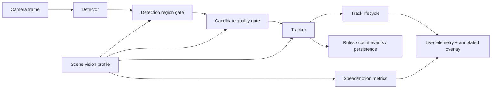

# Scene Vision Profiles And Candidate Quality Design

Date: 2026-05-10

## Goal

Give operators a scene-level way to choose the right balance of accuracy,
latency, and compute cost while making live tracking more trustworthy in
cluttered real scenes.

The immediate validation case is the lab/home camera where the model sometimes:

- detects a pillow/bed area as `person`
- splits one seated person into two people when a laptop or chair occludes the
  body
- produces live telemetry that is technically stable but still admits bad
  candidates

The product target is broader than this room. A scene may later track people,
vehicles, forklifts, packages, animals, vegetation-adjacent motion, or
open-vocabulary targets across low-end edge, capable edge, Jetson-class edge,
and central GPU deployments.

This design adds:

- persisted **Scene Vision Profiles**
- a backend **Candidate Quality Gate**
- explicit **motion/speed metric enablement**
- optional calibration unless motion metrics require it
- separate **detection include/exclusion regions**
- profile-ready hooks for verifiers, ReID, DeepStream/NvDCF-style tracking, and
  open-vocabulary modes

It builds on the already implemented authoritative live track lifecycle. The
backend remains the source of truth for live tracks, active/coasting state,
counts, and annotated overlays.

## Current Findings

The existing calibration and event-boundary stack is partially working:

- `homography` is stored on cameras and mapped into worker config.
- line and polygon zones are normalized with `frame_size`.
- worker config converts normalized points back to the worker frame.
- `Zones` maps polygon footpoints to `zone_id`.
- count events use polygon zones and line boundaries for enter/exit/crossing.
- focused tests passed:
  - `backend/tests/vision/test_homography.py`
  - `backend/tests/vision/test_zones.py`
  - `backend/tests/services/test_camera_worker_config.py`
  - selected camera-service zone normalization tests

The current gaps are:

- speed is effectively always computed when `homography` exists
- camera create requires `homography`, even if a scene only needs detection
- polygon zones label/count events but do not gate detections
- line/polygon event boundaries are overloaded as the only authored geometry
- there is no profile-level policy for model size, tracker settings, candidate
  quality, verification, speed, or detection regions

## Product Requirements

### Profile Selection

During camera/scene setup, the operator should be able to pick a simple mode:

| UI label | Intended use |
|---|---|
| `Fast` | constrained CPU or low-end edge; prioritize low latency |
| `Balanced` | good edge device or central CPU/GPU; default for normal scenes |
| `Maximum Accuracy` | central GPU or advanced edge; spend more compute |
| `Open Vocabulary` | discover or monitor custom text/visual classes |

The system should also store explicit technical fields so the backend can
resolve concrete runtime settings:

- `compute_tier`
- `accuracy_mode`
- `scene_difficulty`
- `object_domain`
- `motion_metrics`
- `candidate_quality`
- `tracker_profile`
- `verifier_profile`

The UI can stay simple while the API remains precise.

### Compute Tiers

Use these tier names in the persisted profile:

| Tier | Examples | Expected capability |
|---|---|---|
| `cpu_low` | old iMac, mini PC CPU | nano/small detector, no ReID, no verifier by default |
| `edge_standard` | good NPU/GPU edge box | small/medium detector, BoT-SORT, suspicious verifier |
| `edge_advanced_jetson` | Jetson Orin Nano Super / Orin class | TensorRT/DeepStream-capable advanced edge profile |
| `central_gpu` | master gateway GPU | larger models, ReID, verifier, open-vocab, multi-stream scheduling |

The Jetson Orin Nano Super belongs in `edge_advanced_jetson`, not low-end. NVIDIA
lists the kit at 67 INT8 TOPS with 1024 CUDA cores, 32 tensor cores, 8GB LPDDR5,
102 GB/s memory bandwidth, and a 7-25W power envelope. That is enough for
advanced tracking features on one or a few streams when the models and tracker
path are optimized.

The first implementation should not reopen Jetson/TensorRT/RTSP work. It should
make the profile and worker contract ready so a later runtime-specific task can
map `edge_advanced_jetson` to TensorRT/DeepStream execution.

### Motion Metrics And Speed

Speed detection must be explicit:

```json
{
  "motion_metrics": {
    "speed_enabled": false
  }
}
```

Rules:

- If `speed_enabled=false`, the worker does not compute `speed_kph` even if a
  homography exists.
- If `speed_enabled=true`, camera creation/update must require a valid
  homography.
- Homography remains allowed without speed enabled, but it should not force speed
  telemetry.
- `speed_kph` remains nullable in telemetry and history.

This turns speed into a scene capability instead of a side effect of calibration.

### Calibration

Calibration should become optional for detection-only scenes:

- Detection, privacy filtering, active class selection, candidate gating, and
  include/exclusion regions must work without homography.
- Speed metrics require homography.
- World-coordinate motion or future 3D tracking can also require homography, but
  that should be a separate capability flag.

Camera creation should no longer require `homography` unless the chosen profile
enables a feature that depends on it.

### Detection Regions

Event zones and detection regions must be separate concepts.

Existing `zones` remain event boundaries:

- `type="line"`: crossing events
- `type="polygon"`: zone enter/exit events and zone labels

Add `detection_regions` for detection gating:

```json
[
  {
    "id": "walkable-floor",
    "mode": "include",
    "polygon": [[80, 120], [1200, 120], [1200, 710], [80, 710]],
    "class_names": ["person"],
    "frame_size": { "width": 1280, "height": 720 }
  },
  {
    "id": "bed-pillow-ignore",
    "mode": "exclude",
    "polygon": [[760, 420], [1260, 420], [1260, 710], [760, 710]],
    "class_names": ["person"],
    "frame_size": { "width": 1280, "height": 720 }
  }
]
```

Semantics:

- If no include region matches a class, the whole frame is included for that
  class.
- If one or more include regions match a class, a candidate must be inside at
  least one include region.
- Exclusion regions override inclusion regions.
- Regions may be class-scoped. Empty `class_names` means all active classes.
- The default policy is full-frame include, no exclusions.

For people and vehicles, the default anchor is the bottom-center footpoint. For
general objects, use bbox center. A profile can override the anchor strategy per
class family.

Best operator guidance:

- use include regions when the detection area is naturally bounded, such as a
  walkway, road lane, gate, shelf, or loading bay
- use exclusion regions for known false-positive islands, such as beds, mirrors,
  screens, vegetation patches, posters, or static clutter
- allow both because real deployments need full-frame monitoring with small
  masks and tightly scoped monitoring with a few holes

### Candidate Quality Gate

Add a backend gate between detector output and tracker input, with a small
post-tracker promotion companion in the lifecycle layer.

The gate must not simply raise the detector threshold globally. ByteTrack-style
tracking needs low-score detections to continue existing tracks through
confidence dips. The gate should instead distinguish:

- low-score detections that plausibly continue an existing stable track
- high-confidence new candidates that may start a new track
- suspicious new candidates that should be dropped, tentatively held, or sent to
  a verifier depending on profile

Pre-tracker gate responsibilities:

- apply detection include/exclusion regions
- apply class-specific minimum detector confidence
- pass low-score candidates when they are near a current active/coasting track
- reject low-score new candidates far from any existing stable track
- suppress obvious duplicate fragments near an existing same-class stable track
- attach quality metadata for downstream telemetry/debugging

Post-tracker/lifecycle responsibilities:

- keep new low-confidence candidates tentative until enough hits
- suppress duplicate same-class tracks that overlap or nest inside an existing
  stable object
- keep active/coasting counts authoritative and stable
- expose candidate rejection counters via metrics

This combination addresses the room issues:

- the pillow is a new static/suspicious candidate, so it should not immediately
  become a visible person
- the occluded seated body fragment is close to an existing stable person, so it
  should be suppressed or held as tentative rather than counted as person #2

### Optional Verifier

Profiles may enable a verifier, but it should run only on suspicious candidates
or new tracks, not every detection every frame.

Verifier modes:

- `none`: no second-stage inference
- `suspicious_only`: verify ambiguous new tracks or potential fragments
- `new_tracks`: verify all new tracks before activation

Verifier examples:

- person crop classifier
- person pose/keypoint sanity
- person segmentation/shape check
- vehicle crop classifier
- domain-specific model pack

The first implementation should define the interface and profile config, but can
ship `none` as the only concrete verifier if model/runtime work is out of scope.

### Profile Presets

Initial presets should resolve to concrete defaults:

| Preset | Detector | Tracker | Gate | Verifier | Motion |
|---|---|---|---|---|---|
| `fast` | nano/small, lower input | ByteTrack or BoT-SORT no ReID | conservative new-track threshold | none | off unless enabled |
| `balanced` | small/medium | BoT-SORT no ReID | ROI + duplicate suppression + tentative | suspicious-only when available | optional |
| `maximum_accuracy` | larger/domain model | BoT-SORT + appearance-ready | stricter new track + verifier hooks | suspicious/new tracks | optional |
| `open_vocabulary` | open-vocab detector | BoT-SORT where possible | stricter confidence + verifier hooks | optional | off by default |

For `edge_advanced_jetson`, `maximum_accuracy` should be allowed, but may resolve
to a Jetson-friendly model/tracker path. DeepStream/NvDCF/NvDeepSORT/ReID should
be a future runtime backend, not a prerequisite for the profile schema.

## Architecture



The profile resolver should be pure and testable. It converts persisted
operator-facing settings into worker runtime settings.

The engine remains responsible for orchestration:

1. detect
2. filter active classes
3. apply detection regions
4. apply candidate quality gate
5. track
6. optionally compute speed
7. apply event zones
8. update lifecycle
9. publish live telemetry and annotated stream
10. persist raw tracking/count data

## Data Model

Prefer JSONB profile fields for the first implementation to avoid churn across
fast-moving profile knobs.

Add to `cameras`:

- `vision_profile JSONB NOT NULL DEFAULT '{}'`
- `detection_regions JSONB NOT NULL DEFAULT '[]'`

Update API contracts:

- `CameraCreate.homography: HomographyPayload | None = None`
- `CameraResponse.homography: HomographyPayload | None = None`
- `CameraCreate.vision_profile`
- `CameraUpdate.vision_profile`
- `CameraResponse.vision_profile`
- `CameraCreate.detection_regions`
- `CameraUpdate.detection_regions`
- `CameraResponse.detection_regions`
- `WorkerConfigResponse.vision_profile`
- `WorkerConfigResponse.detection_regions`

Validation:

- reject speed-enabled profiles without homography
- normalize detection region coordinates like event zones
- reject invalid polygons and out-of-frame coordinates
- reject unknown profile enum values
- keep existing cameras valid by resolving missing profile fields to defaults

## Metrics

Add Prometheus counters:

- `argus_candidate_rejected_total{camera_id, class_name, reason}`
- `argus_candidate_passed_total{camera_id, class_name, reason}`
- `argus_detection_region_filtered_total{camera_id, class_name, region_id, mode}`
- `argus_motion_speed_samples_total{camera_id, class_name}`
- `argus_motion_speed_disabled_total{camera_id}`

Keep stage timing names stable; `speed` can remain a stage but should record as
skipped/near-zero when disabled.

## UI Requirements

Camera wizard and edit flow:

- add a profile choice: Fast, Balanced, Maximum Accuracy, Open Vocabulary
- show compute target: Low CPU, Standard Edge, Advanced Edge, Central GPU
- show `Speed metrics` toggle
- require calibration only when speed is enabled
- separate **Detection regions** from **Event boundaries**
- allow polygon authoring for include/exclusion regions
- show simple explanatory copy:
  - include regions: "Detect only inside these areas"
  - exclusion regions: "Ignore known false-positive areas"
- keep event lines/zones language for crossing and enter/exit events

The UI should avoid pretending that one choice is always best. It should frame
profiles as tradeoffs.

## Out Of Scope

- implementing a DeepStream runtime path
- exporting TensorRT engines
- reopening Jetson RTSP/TensorRT debugging
- training new detectors
- adding a real second-stage verifier model
- changing WebGL policy

The spec prepares those paths but the first implementation should land the
profile, gating, speed-toggle, and region semantics with tests.

## References

- NVIDIA Jetson Orin Nano Super specs: https://www.nvidia.com/en-us/autonomous-machines/embedded-systems/jetson-orin/nano-super-developer-kit/
- NVIDIA DeepStream Gst-nvtracker docs: https://docs.nvidia.com/metropolis/deepstream/9.0/text/DS_plugin_gst-nvtracker.html
- Ultralytics tracking docs: https://docs.ultralytics.com/modes/track/
- Ultralytics predict args: https://docs.ultralytics.com/modes/predict/
- ByteTrack paper: https://arxiv.org/abs/2110.06864
- BoT-SORT paper: https://arxiv.org/abs/2206.14651
