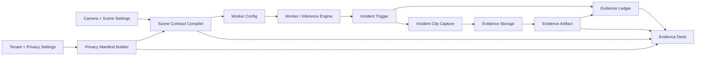

# Accountable Scene Intelligence And Evidence Recording Design

Date: 2026-05-11

## Status

Proposed product-direction slice after the Jetson optimized runtime artifacts and
open-vocab Track A/B work.

This spec turns the first three Vezor differentiators into a concrete
implementation target:

1. **Scene Contract Compiler**
2. **Evidence Ledger**
3. **Privacy Manifest Per Scene**

It also makes incident recording part of the accountability model. Every
incident should carry a short reviewable clip when recording is enabled and
storage policy allows it, including edge deployments.

The remaining differentiators are intentionally deferred:

4. Runtime Passport
5. Operational Memory
6. Prompt-To-Policy
7. Identity-Light Cross-Camera Intelligence

They should be implemented after this slice because they need the same contract,
ledger, privacy, and evidence artifact foundations.

## Product Goal

Make Vezor feel less like a generic video analytics system and more like a
sovereign, auditable scene intelligence platform.

For every incident, an operator should be able to answer:

- What scene configuration was active?
- Which model, vocabulary, zones, rules, gates, and runtime artifact produced
  the event?
- What privacy policy governed the scene?
- What evidence artifact was captured?
- Where is that artifact stored?
- Who or what changed the case state?
- Is the clip available locally, centrally, or in cloud storage?

The product promise is:

> Vezor does not just detect events. It records the contract, evidence, privacy
> posture, and review trail behind each event.

## Current State

The branch already has strong foundations:

- camera-scoped vision profiles and detection regions
- runtime vocabulary state and hashes
- fixed-vocab runtime artifacts and scene-scoped open-vocab artifacts
- worker runtime selection and fallback visibility
- incident rows with `snapshot_url`, `clip_url`, `storage_bytes`, and review
  state
- `IncidentClipCaptureService` with pre/post event frame buffering
- MinIO-backed object storage through `MinioObjectStore`
- Evidence Desk UI that can open clips and review/reopen incidents

Current gaps:

- incident rows do not preserve the scene configuration snapshot that produced
  the event
- privacy behavior is scattered across settings, tenant policy, and payload
  handling rather than surfaced as a scene manifest
- evidence capture writes a clip URL, but not a first-class evidence artifact
  record with provider, checksum, window, and availability state
- review audit exists, but there is no incident-specific evidence ledger
- edge-mode clip availability is not explicit when remote object storage is not
  the chosen storage target

## Non-Goals

- No full VMS recorder.
- No continuous 24/7 recording timeline.
- No face recognition or person identification feature.
- No DeepStream / Track C implementation.
- No blockchain dependency.
- No WebGL.
- No prompt-to-policy compiler in this slice.
- No cross-camera identity graph in this slice.
- No cloud-only requirement.
- No developer-laptop webcam acceptance target in this slice. Laptop OpenCV
  device index support may work opportunistically, but the product target is
  edge Linux/Jetson USB/UVC support.

## Core Concepts

### Scene Contract

A deterministic, versioned JSON snapshot of the scene configuration used by a
worker for one camera.

The contract includes:

- tenant and site identity
- camera identity, source kind, source device reference, and capture mode
- primary model id, capability, format, class list, and source hash
- runtime vocabulary terms, version, source, and hash
- selected runtime artifact id, path hash, target profile, precision, backend,
  and fallback reason when known
- scene vision profile
- detection include/exclusion regions
- candidate quality gate thresholds
- rule/event trigger settings
- recording policy
- evidence storage profile
- privacy manifest hash

The compiler writes or reuses a `scene_contract_snapshots` row keyed by
`contract_hash`. Incidents reference the hash and snapshot id.

### Privacy Manifest

A deterministic, versioned JSON snapshot of the privacy posture for a scene.

The manifest includes:

- whether face identification is disabled by policy
- whether biometric identification is disabled by policy
- whether license plate plaintext may be stored
- the tenant justification required for plaintext plate storage
- privacy filters applied before frames leave the worker
- retention policy for clips and metadata
- storage residency target: edge, central, or cloud
- export/download policy
- human-review requirement

The initial manifest is derived from existing tenant policy, camera settings,
deployment mode, source kind, and recording/storage configuration. It is not a
legal advice engine. It is a product-visible description of what the system was
configured to do.

### Evidence Ledger

An append-only, incident-scoped event log for evidence lifecycle actions.

The ledger records:

- `incident.triggered`
- `scene_contract.attached`
- `privacy_manifest.attached`
- `evidence.clip.capture_started`
- `evidence.clip.available`
- `evidence.clip.quota_exceeded`
- `evidence.clip.capture_failed`
- `incident.reviewed`
- `incident.reopened`
- later: `evidence.exported`, `evidence.downloaded`, `evidence.retained`,
  `evidence.expired`

Each row stores a deterministic `entry_hash` and optional `previous_entry_hash`
for the incident. The hash chain is not a blockchain. It is a simple
tamper-evident product primitive that makes exportable case history stronger.

### Evidence Artifact

A first-class row describing a clip, snapshot, manifest export, or future case
export.

For this slice, the required artifact type is `event_clip`.

An artifact records:

- incident id
- camera id
- kind: `event_clip`
- status: `available`, `local_only`, `remote_available`, `upload_pending`,
  `quota_exceeded`, `capture_failed`, or `expired`
- storage provider: `local_filesystem`, `minio`, or `s3_compatible`
- storage scope: `edge`, `central`, or `cloud`
- bucket/container when relevant
- object key or local object id
- content type
- sha256
- size bytes
- clip start, trigger, and end timestamps
- duration seconds
- fps
- privacy manifest hash
- scene contract hash

The existing `incidents.clip_url` remains for compatibility, but the UI should
move toward artifact-aware review links.

## Recording Requirements

Vezor is not becoming a continuous recorder. The recording feature in this
slice is short event evidence.

### Event Clip Window

Default policy:

- `enabled`: true
- `mode`: `event_clip`
- `pre_seconds`: 4
- `post_seconds`: 8
- `fps`: 10
- `max_duration_seconds`: 15

The exact defaults may be adjusted during implementation if tests show the
current buffering model needs a more conservative setting, but the product rule
is stable: capture a short window that includes the designated event, not a long
surveillance recording.

Each clip must store:

- `clip_started_at`
- `triggered_at`
- `clip_ended_at`
- `duration_seconds`
- `recording_policy`

### Edge Mode Requirement

When a worker runs in edge mode, an incident clip must be available for review
when recording is enabled and quota/policy allows capture.

Supported edge paths:

1. **Edge to central object storage**
   - The edge worker captures frames locally in memory.
   - On incident finalize, it uploads the clip to central MinIO or another
     configured S3-compatible object store.
   - Evidence Desk opens the central signed URL.

2. **Edge local storage**
   - The edge worker writes the clip to a local filesystem evidence directory.
   - The incident artifact is marked `local_only` with `storage_scope=edge`.
   - Review uses an authenticated Vezor API endpoint, not a raw filesystem path.

3. **Edge local-first with remote storage**
   - The edge worker writes local first.
   - If remote upload succeeds, the artifact becomes `remote_available`.
   - If remote upload fails, the artifact remains `upload_pending` or
     `local_only`.
   - Full durable background sync can be a follow-up, but the schema and UI
     status must not block it.

### Storage Options

Operators need clear deployment options:

| Option | Provider | Scope | Intended Use |
|---|---|---|---|
| Local edge filesystem | `local_filesystem` | `edge` | Sovereign, bandwidth-sensitive, offline-tolerant sites |
| Central MinIO | `minio` | `central` | Lab, on-prem, HQ-managed object storage |
| Remote/cloud S3-compatible | `s3_compatible` | `cloud` | Managed retention, backups, multi-site review |
| Local-first remote copy | local plus S3-compatible | edge plus central/cloud | Intermittent connectivity, local review with later central availability |

The first implementation should support local filesystem and the existing
MinIO/S3-compatible path. It should model local-first status even if the first
background sync implementation is deliberately simple.

### Access Model

Evidence Desk should not rely on raw object URLs as the long-term contract.

The backend should expose an authenticated artifact review endpoint:

```text
GET /api/v1/incidents/{incident_id}/artifacts/{artifact_id}/content
```

For remote object storage the endpoint can redirect to a short-lived signed URL.
For local filesystem storage it streams the file. This keeps the UI stable
across local, central, and cloud storage modes.

## Edge USB/UVC Camera Source Requirement

Vezor should support USB camera connections as an edge-first production feature.
The initial target is Linux/Jetson UVC devices exposed as `/dev/video*`, attached
to the edge node that runs the worker.

USB support must be modeled as a camera source type, not as a fake RTSP URL.

Supported source kinds:

| Source kind | Example | First-slice target |
|---|---|---|
| `rtsp` | `rtsp://camera.local/live` | existing network camera path |
| `usb` | `usb:///dev/video0` | production edge UVC path |
| `jetson_csi` | `csi://0` | existing Jetson CSI path normalized into the same contract |

USB behavior:

- USB devices are local to an edge node. A central worker must not try to open
  an edge USB device path.
- USB analytics ingest opens the local V4L2/OpenCV source on the edge worker.
- Browser delivery for USB must use a worker-published stream. Native RTSP
  passthrough is unavailable because MediaMTX cannot pull a local USB device
  from the central control plane.
- Source probing should report width, height, and fps from the device when the
  worker can access it.
- The scene contract records `source.kind="usb"`, the redacted device reference,
  source capability, and capture backend.
- Evidence clips work exactly like RTSP clips because incident recording reads
  frames after source ingest.
- Device references are deployment-local configuration, not global camera
  identities. Moving a USB camera to another edge node requires updating the
  camera source configuration.

## Functional Requirements

### 1. Scene Contract Compiler

Add a deterministic compiler that takes the worker-facing camera configuration
and produces a stable scene contract.

Requirements:

- stable JSON canonicalization
- `schema_version`
- `contract_hash` using sha256 over canonical JSON
- dedupe by hash
- immutable snapshots
- contract attached to every incident
- contract hash visible in Evidence Desk
- contract details available through an authenticated API route

The compiler should run when building worker config and when incident capture
needs a snapshot. It should not depend on frontend-only state.

### 2. Privacy Manifest Per Scene

Add a manifest builder that produces a stable manifest for the scene.

Requirements:

- manifest hash included in the scene contract
- manifest attached to every incident
- visible labels in Evidence Desk:
  - `Face ID disabled`
  - `Biometric ID disabled`
  - `Plate plaintext blocked` or `Plate plaintext allowed`
  - `Local evidence`, `Central evidence`, or `Cloud evidence`
- manifest details available through an authenticated API route
- no face identification is enabled by default

### 3. Evidence Ledger

Add incident-scoped ledger entries.

Requirements:

- append-only write API in service code
- no update route for ledger entries
- hash chain per incident
- ledger rows emitted during incident creation, clip capture, quota failure,
  capture failure, and review/reopen
- ledger summary visible in Incident API responses
- full ledger available through an authenticated route
- Evidence Desk shows a concise ledger strip and a details panel

### 4. Recording And Evidence Artifacts

Extend event clip capture into artifact-aware evidence recording.

Requirements:

- per-camera recording policy with defaults from settings
- worker config carries the recording policy
- incident clips use camera policy for pre/post/fps
- clip artifact rows include provider, scope, key, sha256, size, content type,
  timing, status, scene contract hash, and privacy manifest hash
- object store returns artifact metadata rather than only a URL
- `clip_url` remains populated when a review URL can be generated
- quota failures still create an incident and ledger entry
- local filesystem storage is supported
- MinIO/S3-compatible storage remains supported
- edge-mode local clips are reviewable through the API endpoint

### 5. Camera Source Contract And Edge USB Support

Add a typed camera source contract and make USB/UVC a production edge source.

Requirements:

- camera create/update supports `camera_source`
- existing RTSP cameras are backfilled as `camera_source.kind="rtsp"`
- `rtsp_url` remains accepted as a compatibility field during migration
- USB cameras require `processing_mode="edge"` and an `edge_node_id`
- USB source references use `usb:///dev/videoN`
- worker config carries source kind and source URI
- worker capture resolves USB to V4L2/OpenCV on the edge node
- native RTSP passthrough browser delivery is disabled for USB
- source capability probe supports USB when the device is reachable from the
  worker host
- scene contracts include source kind and redacted device reference
- setup UI presents RTSP and USB as separate source options

### 6. Evidence Desk Visibility

Evidence Desk should surface accountability without becoming a wall of metadata.

Required UI elements:

- `Scene contract` cell with hash prefix and status
- `Privacy manifest` cell with the key privacy labels
- `Evidence clip` cell with local/remote/cloud status
- `Ledger` cell with entry count and latest state
- artifact-aware `Open clip` link
- details panel for scene contract, privacy manifest, and ledger entries

The existing Evidence Timeline and Case Context plan should be retuned around
these concepts rather than treated as separate polish.

## API Shape

Extend `IncidentResponse` with:

```python
scene_contract_hash: str | None = None
scene_contract_id: UUID | None = None
privacy_manifest_hash: str | None = None
privacy_manifest_id: UUID | None = None
recording_policy: dict[str, Any] | None = None
evidence_artifacts: list[EvidenceArtifactResponse] = Field(default_factory=list)
ledger_summary: EvidenceLedgerSummary | None = None
```

Add:

```text
GET /api/v1/incidents/{incident_id}/scene-contract
GET /api/v1/incidents/{incident_id}/privacy-manifest
GET /api/v1/incidents/{incident_id}/ledger
GET /api/v1/incidents/{incident_id}/artifacts/{artifact_id}/content
```

Add or extend camera contracts with:

```python
class CameraSourceSettings(BaseModel):
    kind: Literal["rtsp", "usb", "jetson_csi"] = "rtsp"
    uri: str = Field(min_length=1)
    label: str | None = None


class EvidenceRecordingPolicy(BaseModel):
    enabled: bool = True
    mode: Literal["event_clip"] = "event_clip"
    pre_seconds: int = Field(default=4, ge=0, le=30)
    post_seconds: int = Field(default=8, ge=1, le=60)
    fps: int = Field(default=10, ge=1, le=30)
    max_duration_seconds: int = Field(default=15, ge=1, le=90)
    storage_profile: Literal["edge_local", "central", "cloud", "local_first"] = "central"
```

## Data Model

Create migration `0011_accountable_scene_evidence`.

### `scene_contract_snapshots`

- `id`
- `tenant_id`
- `camera_id`
- `schema_version`
- `contract_hash`
- `contract`
- `created_at`

Indexes:

- unique `contract_hash`
- `camera_id`, `created_at`

### `privacy_manifest_snapshots`

- `id`
- `tenant_id`
- `camera_id`
- `schema_version`
- `manifest_hash`
- `manifest`
- `created_at`

Indexes:

- unique `manifest_hash`
- `camera_id`, `created_at`

### `evidence_artifacts`

- `id`
- `incident_id`
- `camera_id`
- `kind`
- `status`
- `storage_provider`
- `storage_scope`
- `bucket`
- `object_key`
- `content_type`
- `sha256`
- `size_bytes`
- `clip_started_at`
- `triggered_at`
- `clip_ended_at`
- `duration_seconds`
- `fps`
- `scene_contract_hash`
- `privacy_manifest_hash`
- `created_at`
- `updated_at`

Indexes:

- `incident_id`, `kind`
- `camera_id`, `created_at`
- `status`, `storage_scope`

### `evidence_ledger_entries`

- `id`
- `tenant_id`
- `incident_id`
- `camera_id`
- `sequence`
- `action`
- `actor_type`
- `actor_subject`
- `occurred_at`
- `payload`
- `previous_entry_hash`
- `entry_hash`
- `created_at`

Indexes:

- unique `incident_id`, `sequence`
- `incident_id`, `occurred_at`
- `entry_hash`

### `incidents` additions

- `scene_contract_snapshot_id nullable`
- `scene_contract_hash nullable`
- `privacy_manifest_snapshot_id nullable`
- `privacy_manifest_hash nullable`
- `recording_policy JSONB nullable`

### `cameras` additions

- `source_kind String nullable`
- `source_config JSONB nullable`
- `evidence_recording_policy JSONB nullable`

Backfill existing rows with:

- `source_kind="rtsp"`
- `source_config={"kind": "rtsp"}`

Keep `rtsp_url_encrypted` for compatibility until a later cleanup migration.

## Architecture



## Error Handling

- If the scene contract cannot be compiled, worker config load fails loudly.
- If a clip cannot be encoded, create the incident, write
  `evidence.clip.capture_failed`, and set artifact status `capture_failed`.
- If storage quota is exceeded, create the incident, set
  `storage_quota_exceeded`, write `evidence.clip.quota_exceeded`, and show
  `Metadata only` or `No clip storage`.
- If local filesystem storage path is unavailable, mark artifact
  `capture_failed` and include the storage error in ledger payload.
- If remote upload fails after local-first capture, keep the local artifact and
  mark remote state `upload_pending`.
- If a USB device cannot be opened on its assigned edge node, worker config
  remains valid but the worker reports capture failure/reconnect state; setup
  probe should return a clear source-unavailable error.
- If a USB camera is configured without an edge node, camera create/update
  returns `422` with `USB sources require edge processing and an edge node`.
- If a user lacks incident access, contract, manifest, ledger, and artifact
  content routes return `404` rather than leaking cross-tenant existence.

## Testing Requirements

Backend:

- deterministic contract hash tests
- deterministic privacy manifest hash tests
- migration/core DB tests
- artifact store tests for local and MinIO-compatible behavior
- incident capture tests for local, remote, quota exceeded, and capture failed
- ledger hash-chain tests
- incident API route tests
- review/reopen ledger tests
- worker config recording policy tests
- camera source contract tests for RTSP, USB, and Jetson CSI
- USB capture resolution tests that do not require real hardware
- source probe route tests for USB unavailable and USB reachable fake captures

Frontend:

- Evidence Desk renders contract, manifest, clip, and ledger status
- artifact-aware clip link works
- local-only and remote/cloud states are readable
- USB camera setup displays edge-only requirements
- ledger details are keyboard accessible
- privacy labels do not rely on color only
- responsive layout at 375px, 768px, 1024px, and 1440px

Docs:

- runbook storage configuration
- edge deployment notes for local clips
- Evidence Desk review explanation

## Follow-Up Notes For Differentiators 4-7

### 4. Runtime Passport

After this slice, promote runtime selection metadata from a scene contract
section into a dedicated Runtime Passport view:

- selected detector backend
- canonical model hash
- runtime artifact id and hash
- target profile
- precision
- provider versions
- fallback reason
- validation timestamp

This should attach to incidents and operations status, but it should reuse the
contract/ledger foundation from this slice.

### 5. Operational Memory

Use incident contracts, ledgers, and artifacts to build pattern memory:

- repeated event bursts
- recurring privacy/storage failures
- zones that generate repeated incidents
- scene contract changes correlated with incident volume

Do not build this before the ledger exists.

### 6. Prompt-To-Policy

Translate natural-language operator intent into proposed scene contracts,
privacy manifests, recording policy, and rules.

This must be an approval workflow, not prompt-to-magic. The compiler from this
slice becomes the boundary between language and executable configuration.

### 7. Identity-Light Cross-Camera Intelligence

Build cross-camera reasoning without person identity by default:

- class, zone, direction, timing, color/attribute hints where privacy policy
  allows
- no face ID
- no biometric identity graph
- contract and manifest must govern what can be correlated

This should wait until per-incident privacy posture and evidence ledger are
visible.

## Acceptance Criteria

- Every new incident can reference a scene contract hash and privacy manifest
  hash.
- Edge USB/UVC cameras can be configured as `usb:///dev/videoN` sources and run
  through worker-published browser delivery.
- Every captured incident clip has an evidence artifact row.
- Edge-mode local clip storage can produce a reviewable clip through an
  authenticated API endpoint.
- Remote/cloud storage remains configurable through MinIO/S3-compatible
  settings.
- Evidence Desk shows scene contract, privacy manifest, clip storage status,
  and ledger summary.
- Review/reopen actions append ledger rows.
- Existing `clip_url` clients continue to work.
- No continuous recording is introduced.
- No WebGL is introduced.
