# Accountable Scene Intelligence And Evidence Recording Design

Date: 2026-05-11

## Status

Unified implementation runway after the Jetson optimized runtime artifacts and
open-vocab Track A/B work.

Implementation checkpoint, 2026-05-12:

- Tasks 1-13J are implemented and pushed on
  `codex/omnisight-ui-spec-implementation`.
- The current Alembic head is `0014_evidence_expiry_action`.
- The next implementation task is Task 14, optional still snapshot evidence
  artifacts.

This spec turns all still-pertinent handoff items into one ordered
implementation target. The first three Vezor differentiators are still the
foundation and must land first:

1. **Scene Contract Compiler**
2. **Evidence Ledger**
3. **Privacy Manifest Per Scene**

It also makes incident recording part of the accountability model. Every
incident should carry a short reviewable clip when recording is enabled and
storage policy allows it, including edge deployments.

After that foundation, continue in the same plan with:

4. Runtime Passport
5. Operational Memory
6. Prompt-To-Policy
7. Identity-Light Cross-Camera Intelligence

The same implementation runway also carries forward optional still snapshot
artifacts, Runtime Passport, Operational Memory, Prompt-To-Policy,
Identity-Light Cross-Camera Intelligence, Fleet/Operations production
hardening, first-site Jetson runtime artifact soak validation, and the gated
Track C / DeepStream lane. These later tasks must reuse the contract, ledger,
privacy, evidence artifact, and configuration-profile foundations instead of
inventing parallel case-history primitives.

## Product Goal

Make Vezor feel less like a generic video analytics system and more like a
sovereign, auditable scene intelligence platform.

For every incident, an operator should be able to answer:

- What scene configuration was active?
- Which model, vocabulary, zones, rules, gates, and runtime artifact produced
  the event?
- What privacy policy governed the scene?
- What evidence artifact was captured?
- Where is that artifact stored?
- Who or what changed the case state?
- Is the clip available locally, centrally, or in cloud storage?

The product promise is:

> Vezor does not just detect events. It records the contract, evidence, privacy
> posture, and review trail behind each event.

## UI-Managed Configuration Principle

After initial bootstrap, operator-facing configuration must be managed in the
Vezor UI and API, not by editing backend environment variables or running shell
commands. Environment variables remain acceptable only for the minimum
infrastructure that lets the control plane start safely.

Bootstrap-only configuration:

- database, cache, and message-bus connection URLs needed before the API can
  start
- the encryption key used to store UI-managed secrets
- initial identity-provider wiring and first-admin access
- host bind addresses, container ports, and deployment-level service discovery
- break-glass overrides used by support when the UI/API is unavailable

UI-managed configuration:

- evidence storage profiles: edge local disk, central MinIO, cloud
  S3-compatible, and local-first profiles
- retention, quota, privacy, and residency policies
- camera source, recording, stream delivery, and browser delivery profiles
- edge nodes, worker assignments, lifecycle policy, and credential rotation
- model/runtime artifact selection, fallback policy, and runtime validation
  targets
- LLM/provider settings used by Prompt-To-Policy
- DeepStream/runtime-lane settings when Track C is opened

The backend may seed UI-visible defaults from bootstrap environment variables in
development, but once a tenant has a UI-managed profile or binding, that profile
wins. Later tasks must not introduce new product behavior that can only be
configured through env files or command lines.

## Current State

The branch now has strong foundations:

- camera-scoped vision profiles and detection regions
- runtime vocabulary state and hashes
- fixed-vocab runtime artifacts and scene-scoped open-vocab artifacts
- worker runtime selection and fallback visibility
- incident rows with scene-contract, privacy-manifest, recording-policy, clip,
  artifact, storage, and review context
- `IncidentClipCaptureService` with pre/post event frame buffering and
  profile-routed evidence storage
- local filesystem, MinIO/S3-compatible, cloud, edge-local, and local-first
  evidence artifact routing
- evidence ledger entries for incident, artifact, review, upload, expiry, and
  failure paths
- UI-managed configuration profiles, secret redaction, bindings, validation,
  effective configuration diagnostics, and runtime consumers for evidence
  storage, stream delivery, runtime selection, privacy policy, and LLM provider
- Evidence Desk UI that can open clips, show accountability context, and
  review/reopen incidents

Current gaps:

- incident still snapshots are optional and not first-class artifacts yet
- Runtime Passport, Operational Memory, Prompt-To-Policy, and Identity-Light
  Cross-Camera Intelligence are not implemented
- `operations_mode` profiles exist in the UI/configuration plane, but Tasks
  20-22 still need to consume them for supervisor lifecycle, worker assignment,
  and edge credential rotation
- Fleet/Operations still lacks supervisor-backed lifecycle actions,
  per-worker runtime truth, persistent reassignment, and credential rotation
- registered TensorRT and compiled open-vocab artifacts still need first-site
  Jetson soak validation
- Track C / DeepStream is still unimplemented and should stay gated behind
  runtime soak validation

## Non-Goals

- No full VMS recorder.
- No continuous 24/7 recording timeline.
- No face recognition or person identification feature.
- No blockchain dependency.
- No WebGL.
- No cloud-only requirement.
- No developer-laptop webcam acceptance target in this slice. Laptop OpenCV
  device index support may work opportunistically, but the product target is
  edge Linux/Jetson USB/UVC support.
- No prompt-to-policy auto-apply. Prompt-To-Policy must produce reviewable
  drafts that require operator approval.
- No biometric cross-camera identity graph. Identity-Light correlation may use
  class, zone, motion, time, direction, and non-biometric attributes only when
  the privacy manifest allows it.
- No DeepStream work before fixed-vocab TensorRT and compiled open-vocab runtime
  artifacts pass real target Jetson validation.

## Core Concepts

### Scene Contract

A deterministic, versioned JSON snapshot of the scene configuration used by a
worker for one camera.

The contract includes:

- tenant and site identity
- camera identity, source kind, source device reference, and capture mode
- primary model id, capability, format, class list, and source hash
- runtime vocabulary terms, version, source, and hash
- selected runtime artifact id, path hash, target profile, precision, backend,
  and fallback reason when known
- scene vision profile
- detection include/exclusion regions
- candidate quality gate thresholds
- rule/event trigger settings
- recording policy
- evidence storage profile
- privacy manifest hash

The compiler writes or reuses a `scene_contract_snapshots` row keyed by
`contract_hash`. Incidents reference the hash and snapshot id.

### Privacy Manifest

A deterministic, versioned JSON snapshot of the privacy posture for a scene.

The manifest includes:

- whether face identification is disabled by policy
- whether biometric identification is disabled by policy
- whether license plate plaintext may be stored
- the tenant justification required for plaintext plate storage
- privacy filters applied before frames leave the worker
- retention policy for clips and metadata
- storage residency target: edge, central, or cloud
- export/download policy
- human-review requirement

The initial manifest is derived from existing tenant policy, camera settings,
deployment mode, source kind, and recording/storage configuration. It is not a
legal advice engine. It is a product-visible description of what the system was
configured to do.

### Evidence Ledger

An append-only, incident-scoped event log for evidence lifecycle actions.

The ledger records:

- `incident.triggered`
- `scene_contract.attached`
- `privacy_manifest.attached`
- `evidence.clip.capture_started`
- `evidence.clip.available`
- `evidence.clip.quota_exceeded`
- `evidence.clip.capture_failed`
- `incident.reviewed`
- `incident.reopened`
- later: `evidence.exported`, `evidence.downloaded`, `evidence.retained`,
  `evidence.expired`

Each row stores a deterministic `entry_hash` and optional `previous_entry_hash`
for the incident. The hash chain is not a blockchain. It is a simple
tamper-evident product primitive that makes exportable case history stronger.

### Evidence Artifact

A first-class row describing a clip, snapshot, manifest export, or future case
export.

For this slice, the required artifact type is `event_clip`.

An artifact records:

- incident id
- camera id
- kind: `event_clip`
- status: `available`, `local_only`, `remote_available`, `upload_pending`,
  `quota_exceeded`, `capture_failed`, or `expired`
- storage provider: `local_filesystem`, `minio`, or `s3_compatible`
- storage scope: `edge`, `central`, or `cloud`
- bucket/container when relevant
- object key or local object id
- content type
- sha256
- size bytes
- clip start, trigger, and end timestamps
- duration seconds
- fps
- privacy manifest hash
- scene contract hash

The existing `incidents.clip_url` remains for compatibility, but the UI should
move toward artifact-aware review links.

### Operator Configuration Profile

A tenant-scoped, UI-managed configuration object for a product subsystem.
Profiles are typed, named, validated, audited, and optionally bound to a tenant,
site, edge node, or camera.

Examples:

- `evidence_storage`: local disk, central MinIO, cloud S3-compatible, or
  local-first storage
- `stream_delivery`: native, WebRTC, HLS, transcode, and endpoint defaults
- `runtime_selection`: default runtime backend, artifact preference, and
  fallback policy
- `privacy_policy`: retention, plaintext plate posture, blur defaults, and
  residency guardrails
- `llm_provider`: Prompt-To-Policy provider/model settings
- `operations_mode`: supervisor ownership, lifecycle behavior, and edge restart
  policy

Profiles keep non-secret configuration in JSONB and secrets in encrypted
write-only secret records. API responses expose secret presence and fingerprint,
never plaintext. Worker-only resolved configuration may include decrypted
runtime secrets when the caller is authorized as a worker or edge service.

Resolution order:

1. camera binding
2. edge-node binding
3. site binding
4. tenant default profile
5. bootstrap-seeded development default

Resolved worker config should include a version/hash of the configuration
profile payload so incidents can later explain which operator configuration was
active.

### Runtime Consumption Matrix

A profile is not considered product-complete when it merely saves in Settings.
Each profile kind must have a named runtime consumer, a verification path, and
an operator-visible explanation of which profile was applied. Browser-facing
responses stay redacted; worker/service-only resolved configuration may include
decrypted secrets only for the narrow service that consumes them.

| Profile kind | Runtime consumer | Resolution time | Evidence of use |
|---|---|---|---|
| `evidence_storage` | incident capture storage router, artifact content route, local-first sync worker | per incident, using recording policy profile id or camera/edge/site/default binding | artifact provider/scope/status, storage profile id/hash in recording policy and ledger payload |
| `stream_delivery` | worker processed-stream publishing, MediaMTX/WebRTC/HLS/MJPEG delivery URL builders, Live/Evidence playback links | worker config load and playback URL generation | worker config stream section, camera playback response, stream profile id/hash in diagnostics |
| `runtime_selection` | runtime artifact selector and detector factory | worker startup and runtime re-selection after vocabulary/artifact changes | runtime passport, scene contract runtime section, selected profile id/hash and fallback reason |
| `privacy_policy` | privacy manifest builder, recording quota checks, retention/expiry service, plaintext plate guardrails | worker config load, incident finalize, retention sweep | privacy manifest profile id/hash, manifest retention/residency fields, ledger entries for quota/expiry |
| `llm_provider` | Prompt-To-Policy draft compiler and any LLM-backed policy assistant | draft request time | draft metadata with provider/model/profile hash and redacted secret state |
| `operations_mode` | supervisor assignment, lifecycle request validation, restart policy reconciliation, manual/dev control availability | operations API request and supervisor poll/report handling | operations response lifecycle policy, supervisor report reconciliation, lifecycle ledger/audit entry |

Implementation tasks may land the edit/test/bind UI before the runtime consumer,
but the plan must name the consumer task before the UI task is treated as
complete. If a category is intentionally not consumed yet, the task must say
which later task consumes it and which tests prove that handoff.

### Runtime Passport

A Runtime Passport is a product-visible explanation of the runtime that produced
an incident or currently powers a camera.

It promotes runtime metadata already captured in scene contracts into a focused
operator artifact:

- canonical model id and hash
- runtime artifact id, path hash, target profile, precision, and backend
- provider/library versions
- validation timestamp and validation result
- fallback reason when optimized runtime selection was not used
- scene vocabulary hash for compiled open-vocab artifacts

Runtime Passports attach to incident details and Operations camera rows. They
must be derived from scene contracts, model runtime artifact records, and worker
runtime selection reports.

### Operational Memory

Operational Memory is a low-noise pattern layer over incidents, contracts,
artifacts, and ledgers. It should identify repeated operational conditions,
not create a black-box prediction engine.

Examples:

- repeated event bursts by site, camera, zone, class, and time window
- zones that repeatedly generate incidents after a contract change
- storage or clip capture failures clustered by edge node or provider
- incident rate changes after model/runtime/vocabulary changes

Patterns must cite their source incidents and the scene contract/runtime context
that produced them.

### Prompt-To-Policy

Prompt-To-Policy translates operator language into proposed scene contract,
privacy manifest, recording policy, rule, and camera source changes.

It is an approval workflow:

1. operator writes intent
2. backend compiles a draft policy
3. UI shows the diff against current configuration
4. operator approves or rejects
5. approved changes use existing camera/scene update paths
6. ledger records the policy proposal and approval

Prompt text must never directly mutate worker configuration.

### Identity-Light Cross-Camera Intelligence

Identity-Light Cross-Camera Intelligence links events across cameras without
face recognition or biometric identity.

Allowed signals:

- class and open-vocab terms
- zone, line, direction, speed, and motion path
- time proximity and camera topology
- non-biometric attributes only when the privacy manifest allows them

Disallowed by default:

- face identification
- biometric identity graph
- persistent person identity
- license plate plaintext correlation unless the privacy manifest explicitly
  allows plaintext storage

Cross-camera threads must cite the source incidents, privacy manifest hashes,
and confidence rationale.

### Supervisor-Backed Operations

Production Operations must separate desired state from runtime truth.

The control plane stores desired worker assignments and lifecycle requests.
Central and edge supervisors reconcile those requests on the nodes that own the
workers. Supervisors report per-worker state, heartbeat, restart count, last
error, runtime artifact selection, and current scene contract hash.

The backend API process must not shell out to start host processes. Browser
buttons such as Start, Stop, Restart, and Drain create authorized lifecycle
requests that supervisors consume.

### Runtime Artifact Soak

Track A/B runtime artifact support exists in code, but production readiness
requires first-site Jetson validation:

- chosen fixed-vocab TensorRT artifacts, for example YOLO26n, built on or for
  the target Jetson profile
- compiled YOLOE S/open-vocab scene artifacts built for stable scene
  vocabularies
- register, validate, select, run, restart, and rollback flows
- evidence that dynamic `.pt`, ONNX, or CPU fallback is explicit when optimized
  selection is unavailable

Track C / DeepStream remains gated until this soak passes.

## Recording Requirements

Vezor is not becoming a continuous recorder. The recording feature in this
slice is short event evidence.

### Event Clip Window

Default policy:

- `enabled`: true
- `mode`: `event_clip`
- `pre_seconds`: 4
- `post_seconds`: 8
- `fps`: 10
- `max_duration_seconds`: 15

The exact defaults may be adjusted during implementation if tests show the
current buffering model needs a more conservative setting, but the product rule
is stable: capture a short window that includes the designated event, not a long
surveillance recording.

Each clip must store:

- `clip_started_at`
- `triggered_at`
- `clip_ended_at`
- `duration_seconds`
- `recording_policy`

### Edge Mode Requirement

When a worker runs in edge mode, an incident clip must be available for review
when recording is enabled and quota/policy allows capture.

Supported edge paths:

1. **Edge to central object storage**
   - The edge worker captures frames locally in memory.
   - On incident finalize, it uploads the clip to central MinIO or another
     configured S3-compatible object store.
   - Evidence Desk opens the central signed URL.

2. **Edge local storage**
   - The edge worker writes the clip to a local filesystem evidence directory.
   - The incident artifact is marked `local_only` with `storage_scope=edge`.
   - Review uses an authenticated Vezor API endpoint, not a raw filesystem path.

3. **Edge local-first with remote storage**
   - The edge worker writes local first.
   - If remote upload succeeds, the artifact becomes `remote_available`.
   - If remote upload fails, the artifact remains `upload_pending` or
     `local_only`.
   - Durable background sync is part of this runway: pending local-first
     artifacts must retry remote upload, promote the artifact when the remote
     copy is confirmed, and record upload lifecycle ledger entries.

### Storage Options

Operators need clear deployment options:

| Option | Provider | Scope | Intended Use |
|---|---|---|---|
| Local edge filesystem | `local_filesystem` | `edge` | Sovereign, bandwidth-sensitive, offline-tolerant sites |
| Central MinIO | `minio` | `central` | Lab, on-prem, HQ-managed object storage |
| Remote/cloud S3-compatible | `s3_compatible` | `cloud` | Managed retention, backups, multi-site review |
| Local-first remote copy | local plus S3-compatible | edge plus central/cloud | Intermittent connectivity, local review with later central availability |

The storage foundation supports local filesystem and the existing
MinIO/S3-compatible path. The remaining local-first work is the durable retry
and promotion service that turns `upload_pending` local artifacts into confirmed
remote artifacts when connectivity and remote policy allow it.

### Storage Profile Runtime Routing

`EvidenceRecordingPolicy.storage_profile` records the residency intent for a
camera's incident evidence. The concrete endpoint, bucket, local root, and
credentials come from a UI-managed `evidence_storage` operator configuration
profile. Development environment settings may seed a default profile, but they
must not be the only way to configure storage.

The per-camera recording policy or configuration binding selects a profile id at
incident finalization time. The profile's kind and residency must agree with the
recording policy; for example, a camera configured for `cloud` must resolve to an
enabled S3-compatible profile with `storage_scope=cloud`.

The worker must resolve evidence storage per incident, not once globally for the
process. This matters when one worker process handles cameras with different
residency requirements, and it prevents the UI storage selector from becoming a
display-only field.

| `storage_profile` | Runtime route | UI-managed profile fields | First artifact status |
|---|---|---|---|
| `edge_local` | local filesystem, `storage_scope=edge` | local root/path prefix, optional edge node binding | `local_only` |
| `central` | MinIO-compatible object store, `storage_scope=central` | endpoint, bucket, secure flag, access key secret, secret key secret | `remote_available` |
| `cloud` | S3-compatible object store, `storage_scope=cloud` | endpoint, region, bucket, secure flag, access key secret, secret key secret | `remote_available` |
| `local_first` | local filesystem first, optional later remote copy | local root/path prefix plus optional remote storage profile binding | `upload_pending` until a remote copy is confirmed |

`local_first` is not finished when it only writes the first local copy. The
runtime must also persist enough retry state to resume upload after process
restart, support a remote target profile, and record upload attempts without
changing the local review URL. On successful remote promotion, the artifact keeps
its original checksum and clip window, updates storage provider/scope/bucket/url
metadata, and writes a ledger entry tying the remote copy to the original local
capture. On repeated remote failure, the local copy remains reviewable and the
artifact stays `upload_pending` with the latest failure reason visible to
operators.

The backend should keep the existing authenticated artifact content route as the
review contract for all profiles. For `edge_local` and the first slice of
`local_first`, the API streams the local file when the reviewing service can
reach the edge storage path. For `central` and `cloud`, it redirects to a
short-lived signed URL or streams through a service-owned object-store adapter.

If a selected profile is unavailable, the worker must create the incident when
possible, record the storage failure in the evidence ledger, and avoid silently
falling back to another residency profile. A central/cloud upload failure for
`local_first` is not a clip-capture failure if the local write succeeded; it is
an `upload_pending` artifact state.

### Access Model

Evidence Desk should not rely on raw object URLs as the long-term contract.

The backend should expose an authenticated artifact review endpoint:

```text
GET /api/v1/incidents/{incident_id}/artifacts/{artifact_id}/content
```

For remote object storage the endpoint can redirect to a short-lived signed URL.
For local filesystem storage it streams the file. This keeps the UI stable
across local, central, and cloud storage modes.

## Edge USB/UVC Camera Source Requirement

Vezor should support USB camera connections as an edge-first production feature.
The initial target is Linux/Jetson UVC devices exposed as `/dev/video*`, attached
to the edge node that runs the worker.

USB support must be modeled as a camera source type, not as a fake RTSP URL.

Supported source kinds:

| Source kind | Example | First-slice target |
|---|---|---|
| `rtsp` | `rtsp://camera.local/live` | existing network camera path |
| `usb` | `usb:///dev/video0` | production edge UVC path |
| `jetson_csi` | `csi://0` | existing Jetson CSI path normalized into the same contract |

USB behavior:

- USB devices are local to an edge node. A central worker must not try to open
  an edge USB device path.
- USB analytics ingest opens the local V4L2/OpenCV source on the edge worker.
- Browser delivery for USB must use a worker-published stream. Native RTSP
  passthrough is unavailable because MediaMTX cannot pull a local USB device
  from the central control plane.
- Source probing should report width, height, and fps from the device when the
  worker can access it.
- The scene contract records `source.kind="usb"`, the redacted device reference,
  source capability, and capture backend.
- Evidence clips work exactly like RTSP clips because incident recording reads
  frames after source ingest.
- Device references are deployment-local configuration, not global camera
  identities. Moving a USB camera to another edge node requires updating the
  camera source configuration.

## Functional Requirements

### 1. Scene Contract Compiler

Add a deterministic compiler that takes the worker-facing camera configuration
and produces a stable scene contract.

Requirements:

- stable JSON canonicalization
- `schema_version`
- `contract_hash` using sha256 over canonical JSON
- dedupe by hash
- immutable snapshots
- contract attached to every incident
- contract hash visible in Evidence Desk
- contract details available through an authenticated API route

The compiler should run when building worker config and when incident capture
needs a snapshot. It should not depend on frontend-only state.

### 2. Privacy Manifest Per Scene

Add a manifest builder that produces a stable manifest for the scene.

Requirements:

- manifest hash included in the scene contract
- manifest attached to every incident
- visible labels in Evidence Desk:
  - `Face ID disabled`
  - `Biometric ID disabled`
  - `Plate plaintext blocked` or `Plate plaintext allowed`
  - `Local evidence`, `Central evidence`, or `Cloud evidence`
- manifest details available through an authenticated API route
- no face identification is enabled by default

### 3. Evidence Ledger

Add incident-scoped ledger entries.

Requirements:

- append-only write API in service code
- no update route for ledger entries
- hash chain per incident
- ledger rows emitted during incident creation, clip capture, quota failure,
  capture failure, and review/reopen
- ledger summary visible in Incident API responses
- full ledger available through an authenticated route
- Evidence Desk shows a concise ledger strip and a details panel

### 4. Recording And Evidence Artifacts

Extend event clip capture into artifact-aware evidence recording.

Requirements:

- per-camera recording policy with defaults from settings
- worker config carries the recording policy
- incident clips use camera policy for pre/post/fps
- clip artifact rows include provider, scope, key, sha256, size, content type,
  timing, status, scene contract hash, and privacy manifest hash
- object store returns artifact metadata rather than only a URL
- `clip_url` remains populated when a review URL can be generated
- quota failures still create an incident and ledger entry
- local filesystem storage is supported
- MinIO/S3-compatible storage remains supported
- edge-mode local clips are reviewable through the API endpoint

### 5. Camera Source Contract And Edge USB Support

Add a typed camera source contract and make USB/UVC a production edge source.

Requirements:

- camera create/update supports `camera_source`
- existing RTSP cameras are backfilled as `camera_source.kind="rtsp"`
- `rtsp_url` remains accepted as a compatibility field during migration
- USB cameras require `processing_mode="edge"` and an `edge_node_id`
- USB source references use `usb:///dev/videoN`
- worker config carries source kind and source URI
- worker capture resolves USB to V4L2/OpenCV on the edge node
- native RTSP passthrough browser delivery is disabled for USB
- source capability probe supports USB when the device is reachable from the
  worker host
- scene contracts include source kind and redacted device reference
- setup UI presents RTSP and USB as separate source options

### 6. Evidence Desk Visibility

Evidence Desk should surface accountability without becoming a wall of metadata.

Required UI elements:

- `Scene contract` cell with hash prefix and status
- `Privacy manifest` cell with the key privacy labels
- `Evidence clip` cell with local/remote/cloud status
- `Ledger` cell with entry count and latest state
- artifact-aware `Open clip` link
- details panel for scene contract, privacy manifest, and ledger entries

The existing Evidence Timeline and Case Context plan should be retuned around
these concepts rather than treated as separate polish.

### 7. Evidence Timeline And Case Context Polish

Task 13 retuned the Evidence Desk polish plan around accountable evidence.

Requirements:

- Evidence Timeline density strip across the currently loaded incident set
- selected-event marker and bucket selection
- Case Context Strip that includes trigger, evidence, review, retention,
  contract, manifest, and ledger status
- type-colored review queue accents
- cleaner raw payload disclosure that does not compete with decision facts
- support clip-only, snapshot-only, clip-plus-snapshot, and metadata-only cases
- remain frontend-first unless backend fields from Tasks 1-8 are missing

### 8. Optional Incident Still Snapshot Artifacts

Still snapshots are not mandatory for every incident, but deployments may need
them as first-class evidence previews.

Requirements:

- add recording policy fields for still snapshot capture:
  `snapshot_enabled`, `snapshot_offset_seconds`, and `snapshot_quality`
- create `snapshot` evidence artifacts when enabled and capture succeeds
- keep `snapshot_url` nullable when snapshots are disabled or unavailable
- attach snapshot artifact ledger entries:
  `evidence.snapshot.available`, `evidence.snapshot.capture_failed`, and
  `evidence.snapshot.quota_exceeded`
- show snapshot artifact status in Evidence Desk without assuming every incident
  has a still image

### 9. Runtime Passport

Promote runtime metadata from scene contracts and artifact records into a
dedicated passport.

Requirements:

- create immutable runtime passport snapshots keyed by passport hash
- attach runtime passport id/hash to incidents when runtime metadata is known
- expose passport details through incident and operations APIs
- show selected backend, model hash, runtime artifact id/hash, target profile,
  precision, provider versions, validation time, and fallback reason
- include scene vocabulary hash for open-vocab compiled artifacts
- keep fallback explicit when dynamic `.pt` or ONNX is used instead of an
  optimized artifact

### 10. Operational Memory

Build pattern memory on top of incidents, evidence ledger, and scene contracts.

Requirements:

- compute repeated event bursts by site, camera, zone, class, and time window
- detect repeated clip/storage failures by provider, edge node, and camera
- detect zone hot spots and incident changes after scene contract changes
- persist memory pattern snapshots with source incident ids and contract hashes
- show concise memory cards in Evidence Desk and Operations
- avoid predictive claims; present observed patterns and supporting evidence

### 11. Prompt-To-Policy

Compile operator language into proposed policies and scene changes.

Requirements:

- accept a natural-language prompt and target camera/site context
- return a structured draft with camera source, vision profile, detection
  regions, vocabulary, recording policy, privacy posture, and rule changes
- render a diff against the current scene contract
- require explicit operator approval before applying
- apply approved changes through existing camera/scene update paths
- write ledger entries for proposal, approval, rejection, and application
- never mutate worker config directly from prompt text

### 12. Identity-Light Cross-Camera Intelligence

Create non-biometric cross-camera threads.

Requirements:

- correlate incidents using class, zone, direction, time, camera topology, and
  allowed non-biometric attributes
- respect each incident privacy manifest before using attributes
- store thread snapshots with source incident ids, manifest hashes, confidence,
  and rationale
- show cross-camera thread context in Evidence Desk
- keep face ID, biometric identity, and persistent person identity disabled

### 13. Fleet And Operations Production Hardening

Turn the read-first Operations workbench into a supervisor-backed production
control surface.

Requirements:

- persistent worker assignment/reassignment model
- per-worker runtime heartbeat, state, restart count, selected runtime, scene
  contract hash, and last-error reporting
- supervisor lifecycle request model for Start, Stop, Restart, and Drain
- central and edge supervisor polling/claim contract
- Operations UI actions that create lifecycle requests, not shell commands
- credential rotation and bootstrap hardening for edge nodes
- no plaintext secret persistence beyond one-time bootstrap responses
- honest UI states when supervisors have not reported runtime truth

### 14. Production Linux Master And Jetson Runtime Soak

Create a production validation path for Linux master plus Jetson edge.

Requirements:

- run migration and deployment checks on a Linux master topology
- build/register/validate a fixed-vocab TensorRT artifact for the chosen model,
  for example YOLO26n
- build/register/validate compiled YOLOE S/open-vocab scene artifacts for stable
  vocabularies
- verify runtime artifact selection, fallback, restart recovery, clip capture,
  Evidence Desk review, Operations worker truth, and credential rotation
- record soak results in docs with exact versions and known limitations

### 15. Track C / DeepStream Runtime Lane

Implement DeepStream only after Track A/B runtime artifacts pass real Jetson
soak validation.

Requirements:

- define a DeepStream backend contract compatible with existing runtime
  selection and Runtime Passport fields
- add NvDCF/NvDeepSORT profile presets
- bridge DeepStream metadata into existing track lifecycle and event persistence
- add Jetson-only packaging under `infra/deepstream/`
- expose DeepStream pipeline health in Operations
- prove fallback to existing non-DeepStream runtimes remains available

## API Shape

Extend `IncidentResponse` with:

```python
scene_contract_hash: str | None = None
scene_contract_id: UUID | None = None
privacy_manifest_hash: str | None = None
privacy_manifest_id: UUID | None = None
recording_policy: dict[str, Any] | None = None
evidence_artifacts: list[EvidenceArtifactResponse] = Field(default_factory=list)
ledger_summary: EvidenceLedgerSummary | None = None
```

Add:

```text
GET /api/v1/incidents/{incident_id}/scene-contract
GET /api/v1/incidents/{incident_id}/privacy-manifest
GET /api/v1/incidents/{incident_id}/ledger
GET /api/v1/incidents/{incident_id}/artifacts/{artifact_id}/content
GET /api/v1/incidents/{incident_id}/runtime-passport
GET /api/v1/incidents/{incident_id}/cross-camera-threads
GET /api/v1/configuration/catalog
GET /api/v1/configuration/profiles
POST /api/v1/configuration/profiles
PATCH /api/v1/configuration/profiles/{profile_id}
DELETE /api/v1/configuration/profiles/{profile_id}
POST /api/v1/configuration/profiles/{profile_id}/test
POST /api/v1/configuration/bindings
GET /api/v1/configuration/resolved
POST /api/v1/policy-drafts
POST /api/v1/policy-drafts/{draft_id}/approve
POST /api/v1/policy-drafts/{draft_id}/reject
GET /api/v1/operations/memory-patterns
POST /api/v1/operations/workers/{camera_id}/lifecycle
POST /api/v1/operations/workers/{camera_id}/assignment
POST /api/v1/operations/edge-nodes/{edge_node_id}/credentials/rotate
POST /api/v1/operations/supervisor-reports
GET /api/v1/runtime-artifacts/soak-runs
POST /api/v1/runtime-artifacts/soak-runs
```

Add or extend camera contracts with:

```python
class CameraSourceSettings(BaseModel):
    kind: Literal["rtsp", "usb", "jetson_csi"] = "rtsp"
    uri: str = Field(min_length=1)
    label: str | None = None


class EvidenceRecordingPolicy(BaseModel):
    enabled: bool = True
    mode: Literal["event_clip"] = "event_clip"
    pre_seconds: int = Field(default=4, ge=0, le=30)
    post_seconds: int = Field(default=8, ge=1, le=60)
    fps: int = Field(default=10, ge=1, le=30)
    max_duration_seconds: int = Field(default=15, ge=1, le=90)
    storage_profile: Literal["edge_local", "central", "cloud", "local_first"] = "central"
    storage_profile_id: UUID | None = None
    snapshot_enabled: bool = False
    snapshot_offset_seconds: float = Field(default=0.0, ge=-30.0, le=60.0)
    snapshot_quality: int = Field(default=85, ge=1, le=100)
```

## Data Model

Create migration `0011_accountable_scene_evidence`.

### `scene_contract_snapshots`

- `id`
- `tenant_id`
- `camera_id`
- `schema_version`
- `contract_hash`
- `contract`
- `created_at`

Indexes:

- unique `contract_hash`
- `camera_id`, `created_at`

### `privacy_manifest_snapshots`

- `id`
- `tenant_id`
- `camera_id`
- `schema_version`
- `manifest_hash`
- `manifest`
- `created_at`

Indexes:

- unique `manifest_hash`
- `camera_id`, `created_at`

### `evidence_artifacts`

- `id`
- `incident_id`
- `camera_id`
- `kind`
- `status`
- `storage_provider`
- `storage_scope`
- `bucket`
- `object_key`
- `content_type`
- `sha256`
- `size_bytes`
- `clip_started_at`
- `triggered_at`
- `clip_ended_at`
- `duration_seconds`
- `fps`
- `scene_contract_hash`
- `privacy_manifest_hash`
- `created_at`
- `updated_at`

Indexes:

- `incident_id`, `kind`
- `camera_id`, `created_at`
- `status`, `storage_scope`

### `evidence_ledger_entries`

- `id`
- `tenant_id`
- `incident_id`
- `camera_id`
- `sequence`
- `action`
- `actor_type`
- `actor_subject`
- `occurred_at`
- `payload`
- `previous_entry_hash`
- `entry_hash`
- `created_at`

Indexes:

- unique `incident_id`, `sequence`
- `incident_id`, `occurred_at`
- `entry_hash`

### `incidents` additions

- `scene_contract_snapshot_id nullable`
- `scene_contract_hash nullable`
- `privacy_manifest_snapshot_id nullable`
- `privacy_manifest_hash nullable`
- `recording_policy JSONB nullable`

### `cameras` additions

- `source_kind String nullable`
- `source_config JSONB nullable`
- `evidence_recording_policy JSONB nullable`

Backfill existing rows with:

- `source_kind="rtsp"`
- `source_config={"kind": "rtsp"}`

Keep `rtsp_url_encrypted` for compatibility until a later cleanup migration.

### `operator_config_profiles`

Create migration `0012_operator_configuration_profiles`.

- `id`
- `tenant_id`
- `site_id nullable`
- `edge_node_id nullable`
- `camera_id nullable`
- `kind`: `evidence_storage`, `stream_delivery`, `runtime_selection`,
  `privacy_policy`, `llm_provider`, `operations_mode`
- `scope`: `tenant`, `site`, `edge_node`, `camera`
- `name`
- `slug`
- `enabled`
- `is_default`
- `config JSONB`
- `validation_status`: `unvalidated`, `valid`, `invalid`
- `validation_message nullable`
- `validated_at nullable`
- `config_hash`
- `created_at`
- `updated_at`

Indexes:

- unique `tenant_id`, `kind`, `slug`
- `tenant_id`, `kind`, `enabled`
- `tenant_id`, `kind`, `is_default`
- `site_id`, `kind`
- `edge_node_id`, `kind`
- `camera_id`, `kind`

### `operator_config_secrets`

- `id`
- `tenant_id`
- `profile_id`
- `key`
- `encrypted_value`
- `value_fingerprint`
- `created_at`
- `updated_at`

Indexes:

- unique `profile_id`, `key`
- `tenant_id`, `profile_id`

### `operator_config_bindings`

- `id`
- `tenant_id`
- `kind`
- `scope`: `tenant`, `site`, `edge_node`, `camera`
- `scope_key`: `tenant` for tenant default bindings, otherwise the target UUID
  as a string
- `profile_id`
- `created_at`
- `updated_at`

Indexes:

- unique `tenant_id`, `kind`, `scope`, `scope_key`
- `profile_id`

### Later runway tables

After the foundation migration, add follow-on migrations for the remaining
handoff work:

#### `runtime_passport_snapshots`

- `id`
- `tenant_id`
- `camera_id`
- `incident_id nullable`
- `schema_version`
- `passport_hash`
- `passport`
- `created_at`

Indexes:

- unique `passport_hash`
- `camera_id`, `created_at`
- `incident_id`

#### `operational_memory_patterns`

- `id`
- `tenant_id`
- `site_id nullable`
- `camera_id nullable`
- `pattern_kind`
- `summary`
- `severity`
- `source_incident_ids`
- `source_contract_hashes`
- `window_started_at`
- `window_ended_at`
- `pattern_hash`
- `created_at`
- `resolved_at nullable`

Indexes:

- unique `pattern_hash`
- `tenant_id`, `created_at`
- `camera_id`, `created_at`

#### `policy_drafts`

- `id`
- `tenant_id`
- `camera_id nullable`
- `site_id nullable`
- `prompt`
- `draft`
- `diff`
- `status`
- `created_by_subject`
- `approved_by_subject nullable`
- `created_at`
- `decided_at nullable`

Indexes:

- `tenant_id`, `created_at`
- `status`, `created_at`

#### `cross_camera_threads`

- `id`
- `tenant_id`
- `site_id nullable`
- `thread_hash`
- `source_incident_ids`
- `privacy_manifest_hashes`
- `confidence`
- `rationale`
- `created_at`
- `updated_at`

Indexes:

- unique `thread_hash`
- `tenant_id`, `created_at`
- `site_id`, `created_at`

#### `worker_assignments`

- `id`
- `tenant_id`
- `camera_id`
- `edge_node_id nullable`
- `desired_state`
- `assignment_reason`
- `created_by_subject`
- `updated_by_subject`
- `created_at`
- `updated_at`

Indexes:

- unique `camera_id`
- `edge_node_id`, `desired_state`

#### `worker_runtime_reports`

- `id`
- `tenant_id`
- `camera_id`
- `edge_node_id nullable`
- `supervisor_id`
- `runtime_state`
- `heartbeat_at`
- `restart_count`
- `last_error`
- `runtime_backend`
- `runtime_artifact_id nullable`
- `scene_contract_hash nullable`
- `created_at`

Indexes:

- `camera_id`, `heartbeat_at`
- `edge_node_id`, `heartbeat_at`

#### `operations_lifecycle_requests`

- `id`
- `tenant_id`
- `camera_id nullable`
- `edge_node_id nullable`
- `action`
- `status`
- `requested_by_subject`
- `claimed_by_supervisor nullable`
- `requested_at`
- `claimed_at nullable`
- `completed_at nullable`
- `error nullable`

Indexes:

- `status`, `requested_at`
- `camera_id`, `requested_at`
- `edge_node_id`, `requested_at`

#### `runtime_artifact_soak_runs`

- `id`
- `tenant_id`
- `edge_node_id`
- `runtime_artifact_id`
- `runtime_kind`
- `target_profile`
- `status`
- `started_at`
- `ended_at nullable`
- `metrics`
- `notes`
- `created_at`

Indexes:

- `edge_node_id`, `started_at`
- `runtime_artifact_id`, `started_at`

## Architecture

```mermaid
flowchart LR
  ConfigUI["Settings / Configuration UI"] --> ConfigAPI["Configuration API"]
  ConfigAPI --> ConfigProfiles["Operator Config Profiles + Secrets"]
  Camera["Camera + Scene Settings"] --> ContractCompiler["Scene Contract Compiler"]
  Privacy["Tenant + Privacy Settings"] --> ManifestBuilder["Privacy Manifest Builder"]
  ConfigProfiles --> ContractCompiler
  ConfigProfiles --> WorkerConfig
  ManifestBuilder --> ContractCompiler
  ContractCompiler --> WorkerConfig["Worker Config"]
  WorkerConfig --> Worker["Worker / Inference Engine"]
  Worker --> Trigger["Incident Trigger"]
  Trigger --> Capture["Incident Clip Capture"]
  WorkerConfig --> StorageRouter["Storage Profile Router"]
  Capture --> StorageRouter
  StorageRouter --> Store["Evidence Storage"]
  Store --> Artifact["Evidence Artifact"]
  Trigger --> Ledger["Evidence Ledger"]
  Artifact --> Ledger
  Ledger --> Desk["Evidence Desk"]
  Artifact --> Desk
  ContractCompiler --> Desk
  ManifestBuilder --> Desk
  ContractCompiler --> Passport["Runtime Passport"]
  Ledger --> Memory["Operational Memory"]
  Trigger --> CrossCamera["Identity-Light Threads"]
  Privacy --> PolicyDraft["Prompt-To-Policy Drafts"]
  PolicyDraft --> ContractCompiler
  Worker --> RuntimeReport["Worker Runtime Reports"]
  RuntimeReport --> Operations["Supervisor-Backed Operations"]
  Operations --> Soak["Runtime Artifact Soak"]
  Soak --> DeepStream["Track C / DeepStream Gate"]
```



## Error Handling

- If required operator configuration is missing or invalid, the UI blocks
  binding it as a default profile and worker config reports the unresolved
  profile with a clear validation error.
- If a secret-backed profile is read by a browser client, the API returns only
  redacted secret metadata; plaintext secrets are returned only through
  worker-authorized resolved configuration.
- If the scene contract cannot be compiled, worker config load fails loudly.
- If a clip cannot be encoded, create the incident, write
  `evidence.clip.capture_failed`, and set artifact status `capture_failed`.
- If storage quota is exceeded, create the incident, set
  `storage_quota_exceeded`, write `evidence.clip.quota_exceeded`, and show
  `Metadata only` or `No clip storage`.
- If local filesystem storage path is unavailable, mark artifact
  `capture_failed` and include the storage error in ledger payload.
- If remote upload fails after local-first capture, keep the local artifact and
  mark remote state `upload_pending`.
- If local-first retry promotion succeeds later, update the artifact to
  `remote_available`, retain the original local checksum history in ledger
  payload, and keep a reviewable link.
- If a runtime profile is saved and bound but not consumed by its subsystem,
  validation fails for the relevant band; UI-only product configuration is not
  acceptable after the configuration control plane lands.
- If a USB device cannot be opened on its assigned edge node, worker config
  remains valid but the worker reports capture failure/reconnect state; setup
  probe should return a clear source-unavailable error.
- If a USB camera is configured without an edge node, camera create/update
  returns `422` with `USB sources require edge processing and an edge node`.
- If a user lacks incident access, contract, manifest, ledger, and artifact
  content routes return `404` rather than leaking cross-tenant existence.

## Testing Requirements

Backend:

- operator configuration profile, binding, secret-redaction, and resolution
  tests
- profile validation tests for local filesystem and S3-compatible evidence
  storage
- worker-config and subsystem tests proving UI-managed profiles override
  bootstrap settings for evidence storage, stream delivery, runtime selection,
  privacy policy, LLM provider, and operations mode
- local-first retry/promotion tests proving pending artifacts remain reviewable
  and later become remote-available only after confirmed upload
- browser delivery tests proving saved stream profiles affect actual playback
  URLs and USB/non-RTSP delivery paths
- deterministic contract hash tests
- deterministic privacy manifest hash tests
- migration/core DB tests
- artifact store tests for local and MinIO-compatible behavior
- incident capture tests for local, remote, quota exceeded, and capture failed
- ledger hash-chain tests
- incident API route tests
- review/reopen ledger tests
- worker config recording policy tests
- camera source contract tests for RTSP, USB, and Jetson CSI
- USB capture resolution tests that do not require real hardware
- source probe route tests for USB unavailable and USB reachable fake captures
- snapshot artifact tests for enabled, disabled, quota, and capture failure
- runtime passport hash and incident attachment tests
- operational memory pattern detection tests
- prompt-to-policy draft, approval, rejection, and ledger tests
- identity-light correlation tests that prove privacy manifests block disallowed
  attributes
- worker assignment, runtime report, lifecycle request, and credential rotation
  tests
- runtime artifact soak run API tests
- DeepStream backend contract tests after the soak gate is satisfied

Frontend:

- Settings Configuration UI creates, edits, validates, and binds profiles
- secret fields are write-only and render masked state after save
- Camera Wizard selects named configuration profiles instead of requiring
  backend env edits
- Evidence Desk renders contract, manifest, clip, and ledger status
- artifact-aware clip link works
- local-only and remote/cloud states are readable
- USB camera setup displays edge-only requirements
- ledger details are keyboard accessible
- privacy labels do not rely on color only
- responsive layout at 375px, 768px, 1024px, and 1440px
- Evidence Timeline, Case Context Strip, and type-colored queue render with
  accountable artifact states
- Runtime Passport details render in Evidence Desk and Operations
- Operational Memory cards render source incident citations
- Prompt-To-Policy renders a readable diff and requires approval
- Identity-Light threads render rationale and privacy posture
- Operations lifecycle buttons create requests and show supervisor truth without
  implying shell access

Docs:

- runbook storage configuration
- edge deployment notes for local clips
- Evidence Desk review explanation
- supervisor operations deployment notes
- edge credential rotation guidance
- Linux master plus Jetson soak procedure
- DeepStream gate and rollback guidance

## Implementation Order

The implementation plan should execute these tracks in order:

1. Accountable scene and evidence foundation.
2. Evidence Desk timeline/case-context polish and optional still snapshots.
3. Runtime Passport.
4. Operational Memory.
5. Prompt-To-Policy.
6. Identity-Light Cross-Camera Intelligence.
7. Fleet/Operations production hardening.
8. Production Linux master plus Jetson runtime artifact soak.
9. Track C / DeepStream runtime lane, only after the soak gate passes.

This is a single runway, but the later tasks intentionally depend on earlier
data contracts. Do not implement a later feature by creating a parallel
incident, policy, or runtime metadata model.

## Acceptance Criteria

- Every new incident can reference a scene contract hash and privacy manifest
  hash.
- Edge USB/UVC cameras can be configured as `usb:///dev/videoN` sources and run
  through worker-published browser delivery.
- Every captured incident clip has an evidence artifact row.
- Edge-mode local clip storage can produce a reviewable clip through an
  authenticated API endpoint.
- Remote/cloud storage remains configurable through MinIO/S3-compatible
  settings.
- Evidence Desk shows scene contract, privacy manifest, clip storage status,
  and ledger summary.
- Review/reopen actions append ledger rows.
- Existing `clip_url` clients continue to work.
- No continuous recording is introduced.
- No WebGL is introduced.
- Evidence Desk includes timeline density, case context, queue polish, and raw
  payload disclosure that does not crowd decision facts.
- Still snapshots can be enabled as first-class evidence artifacts while
  remaining optional.
- Runtime Passport is visible for incidents and operations rows when runtime
  metadata is available.
- Operational Memory shows observed patterns with source incident citations.
- Prompt-To-Policy produces reviewable drafts and never applies changes without
  approval.
- Identity-Light cross-camera threads use only privacy-allowed non-biometric
  signals.
- Operations supports persistent worker assignments, supervisor-reported runtime
  truth, lifecycle requests, and credential rotation.
- Linux master plus Jetson soak results are documented for fixed-vocab TensorRT
  and compiled open-vocab artifacts.
- DeepStream Track C is either implemented after the soak gate passes or remains
  explicitly blocked with the soak evidence that is missing.
