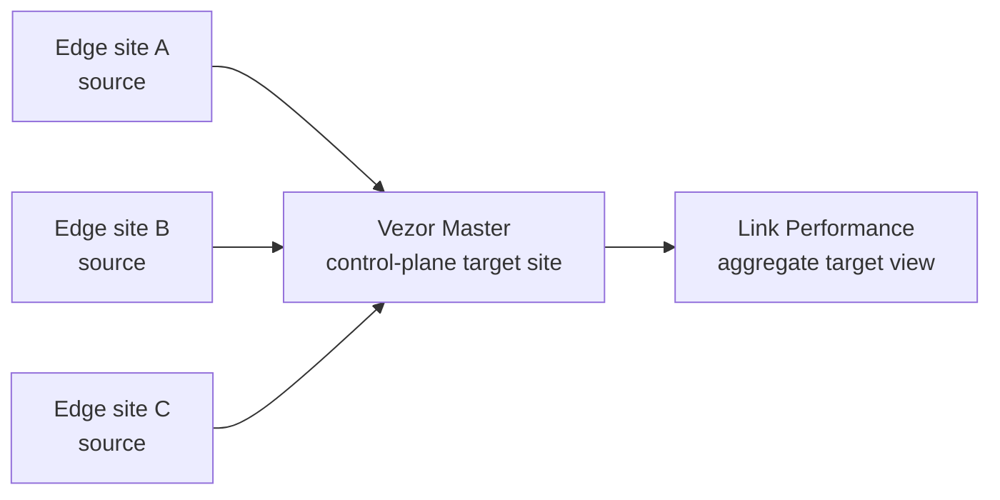

# Core Link Master Target Site Design

## Purpose

Operators need a clear answer to: "Can every edge prove it can reach the Vezor master?" The current edge-only Core Link guard prevents confusing master-side link inventory, but it also hides the master from Link Performance. That makes edge-to-master health feel indirect.

This design makes the master visible as a Link Performance site with a special role: **control-plane target**. Edge sites probe the master. The master view aggregates those edge-originated samples. Operators do not configure ISP links, budgets, queues, or local probes on the master itself.

## Product Model

There are two Link Performance site roles:

- **Edge site**: a real remote site with one or more edge nodes. Operators configure link paths, budgets, policies, monitoring targets, and probes here.
- **Control-plane target site**: the Vezor master. Operators inspect edge-to-master reachability here. They do not add local link paths on this site.

This is intentionally asymmetric:



The source of truth for measurements remains the edge. A probe sample is stored with:

- `site_id`: the source edge site.
- `target_site_id`: the target site, usually the master control-plane site for this flow.
- `target_id`: the target within the edge site's monitoring config, such as `vezor-master-https` or `vezor-master-udp-reflector`.

The master site view is an inverse view over `target_site_id = master_site_id`.

## Recommended Approach

Use a persisted control-plane `Site` row, not a purely virtual UI row. It gives us stable IDs for URLs, APIs, filters, audit trails, and future relationships.

Add a `site_kind` field to `sites`:

- `edge`: default for existing and operator-created sites.
- `control_plane`: reserved for the Vezor master site.

At master bootstrap, create or repair one `control_plane` site named `Vezor Master`. During migration or service startup repair, backfill the same site for existing tenants. If the tenant already has one, reuse it. Do not require an `EdgeNode` row for this site.

## Capabilities

Expose explicit capabilities in Link summary responses so the UI is not guessing from labels:

```json
{
  "site_id": "00000000-0000-4000-8000-000000000010",
  "site_name": "Vezor Master",
  "site_role": "control_plane",
  "capabilities": {
    "can_configure_links": false,
    "can_configure_targets": false,
    "can_record_manual_samples": false,
    "can_receive_edge_samples": true,
    "can_show_queue": false,
    "can_show_budget": false,
    "can_show_policy": false
  }
}
```

For an edge site:

```json
{
  "site_role": "edge",
  "capabilities": {
    "can_configure_links": true,
    "can_configure_targets": true,
    "can_record_manual_samples": true,
    "can_receive_edge_samples": true,
    "can_show_queue": true,
    "can_show_budget": true,
    "can_show_policy": true
  }
}
```

## API Behavior

The Link summary endpoint includes both roles:

- Edge sites appear as normal.
- The master control-plane target site appears with a `Control plane target` role.

Allowed for edge sites:

- `GET /api/v1/link/sites/{site_id}/status`
- `GET/POST/PATCH/DELETE /connections`
- `GET/PUT /budget`
- `GET/PUT /policies`
- `GET /queue`
- `GET/POST/DELETE /probes`
- `POST /probe-targets/{target_id}/edge-samples`
- `POST /probe-targets/{target_id}/run`
- `POST /probe-targets/{target_id}/measure-throughput`

Allowed for the master control-plane target site:

- `GET /api/v1/link/sites/{master_site_id}/status`
- `GET /api/v1/link/sites/{master_site_id}/probes`
- `GET /api/v1/link/sites/{master_site_id}/edge-sources`

Rejected for the master control-plane target site with `409 Conflict`:

- Create/update/delete local link paths.
- Create/update budgets or policies.
- Record manual probes against the master as the source site.
- Run backend synthetic probes from the master view.
- Run throughput measurements from the master view.

## Master Probe Targets

Every edge site should get a first-class "Vezor Master" target option. The operator should not type JSON.

Default HTTPS target:

```json
{
  "id": "vezor-master-https",
  "label": "Vezor Master API",
  "address": "https://vezor.example.com/api/v1/health",
  "target_site_id": "00000000-0000-4000-8000-000000000010",
  "probe_type": "https",
  "purpose": "vezor_control",
  "monitoring": {
    "enabled": true,
    "source_type": "edge_agent",
    "interval_seconds": 300
  },
  "loss_method": "icmp_sequence",
  "loss_packet_count": 20
}
```

Default UDP reflector target, when reflector support is enabled:

```json
{
  "id": "vezor-master-udp-reflector",
  "label": "Vezor Master reflector",
  "address": "vezor.example.com",
  "target_site_id": "00000000-0000-4000-8000-000000000010",
  "probe_type": "udp",
  "purpose": "vezor_control",
  "monitoring": {
    "enabled": true,
    "source_type": "edge_agent",
    "interval_seconds": 300
  },
  "loss_method": "udp_sequence",
  "loss_packet_count": 50,
  "loss_packet_spacing_ms": 100,
  "loss_timeout_ms": 1000,
  "reflector_address": "vezor.example.com",
  "reflector_port": 8622,
  "reflector_mode": "vezor_udp_sequence",
  "reflector_key_id": "master-reflector-2026-06"
}
```

## Master View

When the selected site role is `control_plane`, the Link Performance page changes from edge-site operations to target observability:

- Header: `Vezor Master`
- Role badge: `Control plane target`
- Primary panel: aggregate reachability from all edge sites.
- Source table: one row per edge site with latest latency, loss, status, last sample time, probe method, and target id.
- Sample history: all probes where `target_site_id` is the master site.
- Reflector panel: read-only status for HTTPS health and UDP reflector endpoints.

Do not show:

- Add link path
- Budget and policy editor
- Queue depth panel
- Manual sample button
- Throughput measurement button

## Edge View

When an edge site is selected, the operator can add or enable a Vezor Master target from the monitoring target form:

- Target preset: `Vezor Master`
- Method: `HTTPS`, `ICMP sequence`, or `UDP reflector` when available
- Interval
- Packet count
- DSCP if supported

The target is stored on the edge site's link path metadata. Samples are recorded under the edge site and cross-linked to the master with `target_site_id`.

## Data Model

Add:

- `sites.site_kind text not null default 'edge'` with allowed values `edge`, `control_plane`.
- `link_health_probes.target_site_id uuid null references sites(id)`.
- Index `ix_link_health_probes_tenant_target_site_recorded` on `(tenant_id, target_site_id, recorded_at desc)`.
- Backfill one `control_plane` `Vezor Master` site per existing tenant during migration or idempotent service repair.

Optional in the same implementation if UDP reflector config is included:

- `link_reflector_profiles`, scoped to a control-plane site:
  - `id`
  - `tenant_id`
  - `site_id`
  - `mode`
  - `public_address`
  - `udp_port`
  - `key_id`
  - `secret_ref`
  - `enabled`
  - `allowed_edge_site_ids`
  - `created_at`
  - `updated_at`

Keep `target_site_id` as a real column instead of hiding it inside JSON metadata. The master view needs efficient inverse queries.

## Security

- Edge samples must be accepted only from an authenticated user or edge-agent credential allowed for the source edge site.
- Edge samples may set `target_site_id` only to a tenant-scoped site with role `control_plane` or another explicitly supported target role.
- Control-plane target sites reject local link configuration mutations.
- Reflector packet secrets are not API bearer tokens.
- Reflector endpoints rate-limit and authenticate UDP sequence packets.

## Acceptance Criteria

- The Link Performance selector shows the master as `Control plane target`.
- The master selected view shows edge-to-master reachability and sample history.
- The master selected view does not expose add/edit/delete link paths, budget/policy editing, queue controls, manual samples, or throughput measurement buttons.
- Edge sites can add a `Vezor Master` monitoring target without JSON.
- Edge-agent samples posted from an edge site can target the master site.
- Master status is derived from edge-originated samples, not backend probes from the master network.
- API tests prove master local configuration is rejected while edge-to-master samples are accepted.
