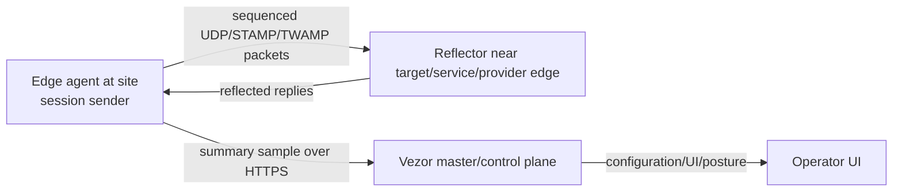

# Core Link Reflector Packet Loss Design

## Purpose

The current edge-agent implementation gives Vezor an honest source-side packet-loss path by running ICMP from the edge site and posting packet counts to the control plane. That is useful, but ICMP is not a complete operational answer: ICMP may be filtered, rate limited, deprioritized, or routed differently from the real application path.

The next step is an edge-agent plus reflector flow. The edge agent sends sequenced measurement packets from the site. A known reflector at the far end replies to those packets. The edge agent computes packet loss, latency, jitter, duplicates, and out-of-order delivery, then posts a summarized sample to Vezor.

## Plain Model

Yes: edge sites run the measurements. The Vezor master/control plane does not measure the edge site's path by itself.

Roles:

- **Vezor master/control plane**: stores edge-site target configuration, displays monitoring posture, accepts summarized probe samples, can optionally provide recommended commands, and may host deployment-level reflector profiles.
- **Edge agent**: runs at or near the site/link path. It is the measurement source and sends active probe packets.
- **Reflector**: runs at the far end of the measured path. It receives probe packets and sends replies. It may be a Vezor-managed regional service, a customer-controlled host, another Vezor edge agent in reflector mode, or a provider/STAMP/TWAMP endpoint.

The master can run a reflector process in a lab or single-node deployment, but that is a deployment-level reflector endpoint, not a Link Performance site. Link paths, monitoring targets, and probe samples are only configured for edge sites. In production, reflector placement should be explicit because the measured path is "edge site to reflector," not "edge site to Vezor in general."



## Recommended Approach

Build the reflector path in three phases:

1. **Vezor UDP sequence protocol**: implement a small authenticated UDP sender/reflector pair. It is not advertised as STAMP-compliant, but it uses the same active-measurement principles: session id, sequence number, transmit timestamp, receive timeout, and reflected replies.
2. **STAMP-compatible packet mode**: add packet formats and state handling compatible with STAMP Session-Sender and Session-Reflector semantics where feasible.
3. **Provider/device integration**: add TWAMP/STAMP import or active sessions for routers, SD-WAN platforms, or provider endpoints that already expose measurement responders.

The first phase is the best product path because it can be tested end to end inside Vezor without waiting on network equipment support.

## Site Eligibility

Core Link is an edge-site feature. The UI and API should use this rule:

- A site is eligible for Link Performance only when it has a registered edge node.
- A master/control-plane deployment node is not a Link Performance site.
- Link paths, budgets, policies, monitoring targets, manual probe samples, edge-agent samples, backend synthetic probe runs, and throughput measurements are rejected for non-edge/master sites.
- The Link Performance site selector lists only eligible edge sites.
- A master-hosted reflector can still be offered as a reflector endpoint for an edge site's target. That configuration belongs to Deployment/Reflectors or equivalent platform settings, not to the master site.

This avoids the confusing model where operators add a "connection" to the master. The master stores and optionally reflects measurements; the edge site owns the measured link.

## Master Reflector Configuration

When the master hosts a reflector, configure it as a deployment service profile:

```json
{
  "id": "master-reflector-default",
  "scope": "deployment",
  "host_role": "master",
  "bind_address": "0.0.0.0",
  "udp_port": 8622,
  "mode": "vezor_udp_sequence",
  "key_id": "master-reflector-2026-06",
  "secret_ref": "secret://vezor/link-reflectors/master-reflector-2026-06",
  "allowed_edge_site_ids": ["site-edge-home"],
  "allowed_source_cidrs": ["198.51.100.0/24"],
  "rate_limit_pps_per_source": 100,
  "enabled": true
}
```

Edge-site monitoring targets may reference this profile or specify an explicit reflector address. They still remain edge-site targets because the measurement source is the edge agent.

## Why Not Master-Only Probes

Backend or master probes measure from the backend network to a target. They do not measure from the edge site across its ISP, SD-WAN, LTE, satellite, Wi-Fi, or third-party handoff.

For the operator's question, the answer is:

- **Edge to reflector** measures the real edge path.
- **Master to target** measures the backend/control-plane path.
- **Edge to master reflector** measures whether the edge path to Vezor is healthy.
- **Edge to service reflector** measures whether the edge path to that service/network is healthy.

These are different paths and should be labelled separately in the UI.

## Measurement Semantics

Packet loss must be computed from sequence observations, not typed in as an arbitrary percentage:

```text
sent = number of unique probe sequence numbers transmitted
received = number of unique replies received before the loss timeout
lost = sent - received
loss_percent = lost / sent * 100
```

Late replies are counted separately:

- A reply received before the timeout is received.
- A reply received after the timeout is late.
- A duplicate reply increments duplicate count but not received count.
- A reply with an unknown session id or bad authentication is discarded.

Latency:

- Without synchronized clocks, report round-trip latency only.
- With synchronized clocks and a protocol that includes reflector receive/transmit timestamps, one-way delay may be reported with a clock-sync quality marker.
- Vezor should not label one-way delay as authoritative unless the clocks and protocol support it.

Jitter/variation:

- For the first Vezor UDP sequence implementation, compute variation from the observed RTT sample set and label it as `rtt_variation_ms`.
- Future STAMP/TWAMP modes can expose protocol-specific delay variation metadata.

## Packet Format, Phase 1

Use a compact binary UDP packet with authenticated session data:

| Field | Size | Purpose |
| --- | ---: | --- |
| magic | 4 bytes | `VZLP` |
| version | 1 byte | protocol version, initially `1` |
| flags | 1 byte | request/reply and future options |
| header length | 2 bytes | permits future extension |
| session id | 16 bytes | random per measurement session |
| sequence | 8 bytes | unsigned sequence number |
| transmit monotonic ns | 8 bytes | sender monotonic timestamp |
| payload nonce | 8 bytes | random per packet |
| auth tag | 16 bytes | truncated HMAC-SHA256 |

The reflector echoes the session id, sequence, sender timestamp, and nonce in a reply packet. It adds its own receive/transmit timestamps only when configured to do so. HMAC prevents unauthenticated reflection and lets the reflector discard spoofed traffic.

## Security And Abuse Controls

Reflectors can become amplification tools if designed casually. The Vezor reflector must be conservative:

- Reply only to authenticated packets with a valid HMAC.
- Reply with a packet no larger than the request unless an explicitly authenticated mode allows otherwise.
- Rate-limit by source IP, session id, and tenant/site where known.
- Bind to configured UDP ports only.
- Support allowlists for expected edge-agent source networks.
- Never accept a master API token as a UDP packet secret.
- Rotate reflector session secrets independently from UI/API bearer tokens.
- Log aggregate counters, not raw packet contents.

## Target Configuration

Extend monitoring target metadata for reflector measurement:

```json
{
  "id": "target-openwisp-reflector",
  "label": "OpenWISP reflector",
  "address": "openwisp.mugetsu.tech",
  "probe_type": "udp",
  "purpose": "custom",
  "monitoring": {
    "enabled": true,
    "source_type": "edge_agent",
    "interval_seconds": 300
  },
  "loss_method": "udp_sequence",
  "loss_packet_count": 50,
  "loss_packet_spacing_ms": 100,
  "loss_timeout_ms": 1000,
  "loss_dscp": 46,
  "reflector_address": "openwisp.mugetsu.tech",
  "reflector_port": 8622,
  "reflector_mode": "vezor_udp_sequence",
  "reflector_key_id": "home-reflector-2026-06"
}
```

Do not overload `address` silently. `address` is the human/network target. `reflector_address` is the exact UDP responder address.

## Sample Metadata

The edge agent posts summarized samples using the existing edge sample route or its successor:

```json
{
  "agent_id": "macbook-home",
  "agent_label": "MacBook at home",
  "method": "udp_sequence",
  "packet_count": 50,
  "packets_received": 49,
  "latency_ms": 24,
  "jitter_ms": 2.1,
  "duration_ms": 5900,
  "dscp": 46,
  "measured_at": "2026-06-07T12:00:00+00:00"
}
```

Add richer `measurement_metadata`:

```json
{
  "protocol": "vezor_udp_sequence",
  "protocol_version": 1,
  "agent_id": "macbook-home",
  "reflector_id": "home-reflector",
  "reflector_address": "openwisp.mugetsu.tech",
  "reflector_port": 8622,
  "session_id": "4de7b5b4264f4f568aa76d5d80e0e94f",
  "packet_count": 50,
  "packets_received": 49,
  "packets_lost": 1,
  "packets_late": 0,
  "packets_duplicate": 0,
  "packets_out_of_order": 0,
  "loss_timeout_ms": 1000,
  "packet_spacing_ms": 100,
  "packet_size_bytes": 64,
  "rtt_min_ms": 18.4,
  "rtt_avg_ms": 24.2,
  "rtt_p95_ms": 31.7,
  "rtt_max_ms": 38.0,
  "rtt_variation_ms": 2.1,
  "clock_sync": "not_required_round_trip",
  "dscp": 46
}
```

## UI Changes

The operator should not see protocol internals first. The UI should expose practical fields:

- Measurement source: `Edge agent`
- Method: `ICMP sequence`, `UDP sequence`, `STAMP`, `TWAMP`
- Reflector address
- Reflector UDP port
- Packet count
- Packet spacing
- Reply timeout
- Optional DSCP
- Optional key id / secret reference

Target cards should show:

- `UDP sequence via openwisp.mugetsu.tech:8622`
- `50 packets every 5 min`
- `Timeout 1000 ms / DSCP 46`

Sample history should show:

- `49/50 received`
- `2% loss`
- `24 ms RTT avg`
- `2.1 ms RTT variation`
- `1 lost / 0 late / 0 duplicate`

## Operational Examples

Home server reflector:

```bash
python -m argus.link.reflector \
  --bind 0.0.0.0 \
  --port 8622 \
  --key-id home-reflector-2026-06 \
  --secret "$REFLECTOR_SECRET"
```

MacBook edge sender:

```bash
python -m argus.link.edge_agent \
  --api-base-url https://vezor.example \
  --bearer-token "$TOKEN" \
  --site-id "$SITE_ID" \
  --target-id target-openwisp-reflector \
  --agent-id macbook-home \
  --agent-label "MacBook at home" \
  --method udp_sequence \
  --reflector openwisp.mugetsu.tech:8622 \
  --reflector-key-id home-reflector-2026-06 \
  --reflector-secret "$REFLECTOR_SECRET" \
  --packet-count 50 \
  --packet-spacing-ms 100 \
  --loss-timeout-ms 1000 \
  --once
```

## Acceptance Criteria

- Operators can configure a reflector-backed monitoring target without JSON.
- The Link Performance selector and API expose configuration only for edge sites.
- Master/control-plane sites cannot receive link paths, monitoring targets, probe samples, or throughput measurements.
- A master-hosted reflector is configured as deployment infrastructure, not as a master-site link path.
- Edge agent can run a UDP sequence measurement against a reflector.
- Reflector replies only to authenticated measurement packets.
- Agent computes loss, RTT statistics, variation, duplicate, late, and out-of-order counters.
- Agent posts a summarized sample to Vezor.
- UI labels the measurement path as edge-to-reflector, not backend-to-target.
- ICMP remains available as a no-reflector fallback.

## Standards Context

- IPPM one-way loss defines packet loss in terms of sent packets that do not arrive within a reasonable threshold.
- STAMP defines a simple two-way active measurement protocol for delay, delay variation, and packet loss.
- TWAMP is the older two-way active measurement protocol commonly supported by network equipment.

References:

- RFC 7680: IPPM One-Way Packet Loss
- RFC 8762: STAMP
- RFC 8972: STAMP Optional Extensions
- RFC 5357: TWAMP
- RFC 8913: TWAMP YANG Data Model
