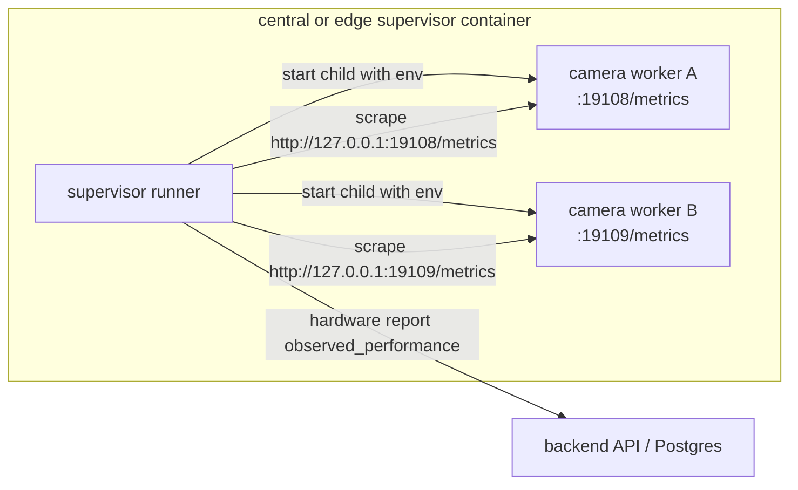

# Supervisor Per-Worker Metrics Design

Date: 2026-06-11
Branch: `codex/sceneops-pack-registry`

## Goal

Make central and edge supervisors report accurate per-camera FPS and stage latency when multiple camera workers run under one supervisor process.

## Problem

The current worker metrics model assumes one Prometheus endpoint per supervisor container. That works for a single Jetson edge worker because one child can bind `9108`, but it fails for central supervisors that can run multiple child camera workers in the same container. Only one process can bind a fixed port, and the master supervisor currently disables worker metrics entirely. The result is fresh runtime heartbeats and live streams, but no central `observed_fps` in hardware reports.

This feature does not change inference, MediaMTX publishing, DeepStream, TensorRT selection, or RTSP authentication. It only fixes worker observability.

## Non-Goals

- Do not expose every worker metrics port on the LAN.
- Do not use MediaMTX reader tokens or RTSP probing as the source of inference FPS.
- Do not implement DeepStream.
- Do not claim central GPU acceleration.
- Do not replace runtime heartbeats; metrics augment hardware performance reports only.

## Architecture

The supervisor allocates a private metrics port for each child camera worker. The child worker binds a local Prometheus endpoint, and the parent supervisor scrapes that endpoint over container-local loopback.

The backend and UI keep reading FPS from hardware reports, not from direct worker metrics endpoints.

## Configuration

Supervisor-only settings:

- `ARGUS_SUPERVISOR_WORKER_METRICS_ENABLED`
  - Enables per-worker metrics allocation.
  - Default: `false` for backward compatibility.
  - Master install compose should set this to `true`.
- `ARGUS_SUPERVISOR_WORKER_METRICS_BIND_ADDR`
  - Address passed to child workers.
  - Default: `127.0.0.1`.
- `ARGUS_SUPERVISOR_WORKER_METRICS_SCRAPE_HOST`
  - Host used by the parent supervisor when building scrape URLs.
  - Default: `127.0.0.1`.
- `ARGUS_SUPERVISOR_WORKER_METRICS_PORT_BASE`
  - First allocatable metrics port.
  - Default: `19108`.
- `ARGUS_SUPERVISOR_WORKER_METRICS_PORT_COUNT`
  - Number of ports available in the local allocation range.
  - Default: `200`.

Child-worker settings remain unchanged:

- `ARGUS_ENABLE_WORKER_METRICS_SERVER=true`
- `ARGUS_WORKER_METRICS_PORT=<allocated port>`
- `ARGUS_WORKER_METRICS_BIND_ADDR=<bind addr>`

Existing single-endpoint `worker_metrics_url` remains supported. It is the fallback for legacy edge setups and tests where all camera metrics are available from one endpoint.

## Worker Launch Behavior

`LocalWorkerProcessAdapter` owns port allocation because it owns child process lifecycle.

When starting a worker:

1. If the worker is already running, reuse its existing metrics URL.
2. If per-worker metrics are disabled, launch as today.
3. If enabled, allocate the first free port from `[port_base, port_base + port_count)`.
4. Inject the child metrics env vars.
5. Store `camera_id -> metrics_url`.
6. If subprocess startup fails or exits during startup probe, release the allocation.

When stopping, draining, or replacing a dead process:

1. Terminate the child as today.
2. Release the camera's metrics port and URL.

If no port is available, worker start fails truthfully with `runtime_state="error"` and a message naming the exhausted range.

## Scrape Behavior

`WorkerMetricsContext` gains `metrics_url: str | None`.

`WorkerMetricsProbe` changes from a single scrape target to a multi-target probe:

- Group contexts by `context.metrics_url` when present.
- Use the probe's legacy `metrics_url` only for contexts without a per-worker URL.
- Scrape each distinct URL once per hardware report cycle.
- Keep previous snapshots per URL so `observed_fps` deltas remain correct.
- If one endpoint fails, skip only that endpoint. Other worker samples still report.

## Runtime Reporting

Runtime heartbeats remain independent from performance metrics. A camera is `running` only when a fresh per-camera runtime report exists. `observed_fps` is a hardware-performance sample and must not be used to infer runtime state by itself.

## Security

Metrics URLs are local supervisor-container URLs. They do not contain RTSP credentials, JWTs, or MediaMTX tokens. Install compose must not publish the per-worker port range to the host by default.

## Testing Requirements

- Process adapter tests cover unique port allocation, env injection, release on stop, release on startup failure, and exhausted port range.
- Metrics probe tests cover multi-target scraping, partial scrape failure, and backward-compatible single-target scraping.
- Runner tests cover config parsing and attaching adapter-provided metrics URLs to worker contexts.
- Engine tests cover metrics bind address behavior.
- Install compose/docs checks confirm master central enables per-worker metrics without host port exposure.

## Live Smoke Requirements

When the stack is running:

- Central supervisor hardware report includes at least one `observed_performance` sample for the central camera after two scrape intervals.
- Central runtime report remains fresh and `onnxruntime` with no Jetson TensorRT artifact id.
- Edge runtime report remains fresh with `jetson_gstreamer_native` / `gstreamer_appsink`.
- Jetson legacy or per-worker metrics still produce `observed_fps`.
- If services are down, standby, or stale, mark live smoke as `NOT RUN` or `FAIL` with concrete evidence.
