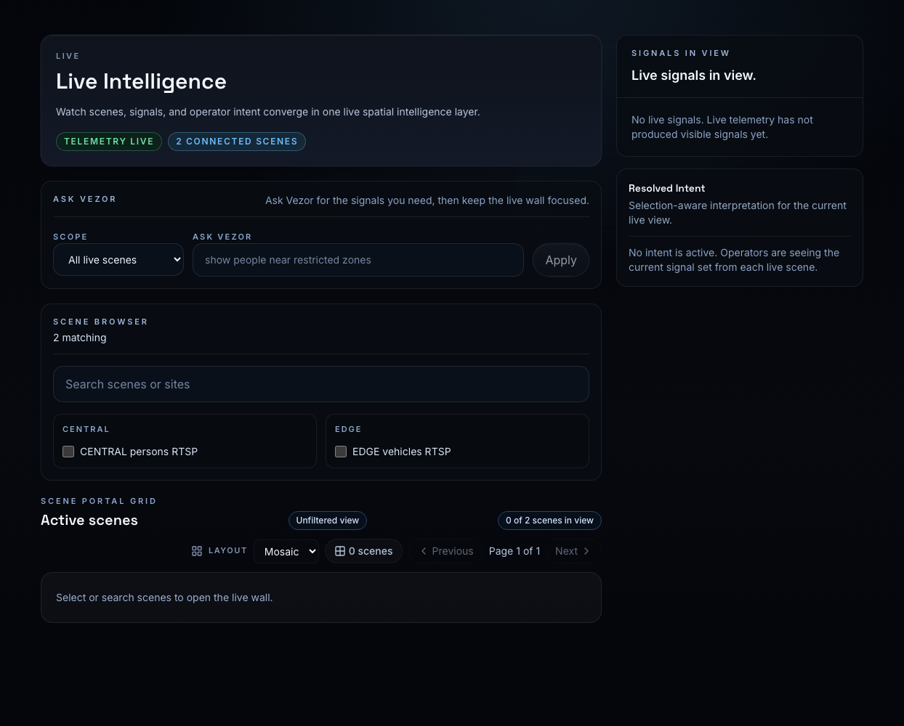
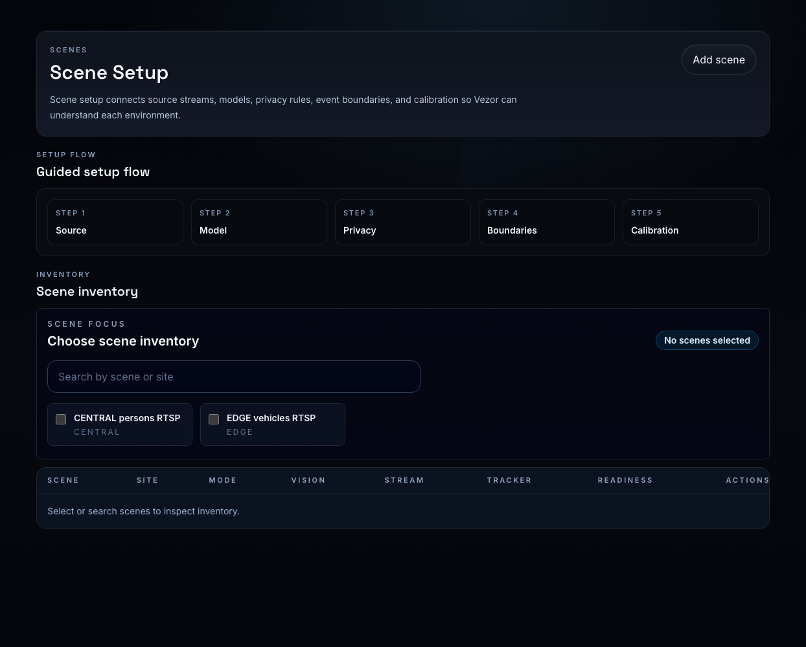
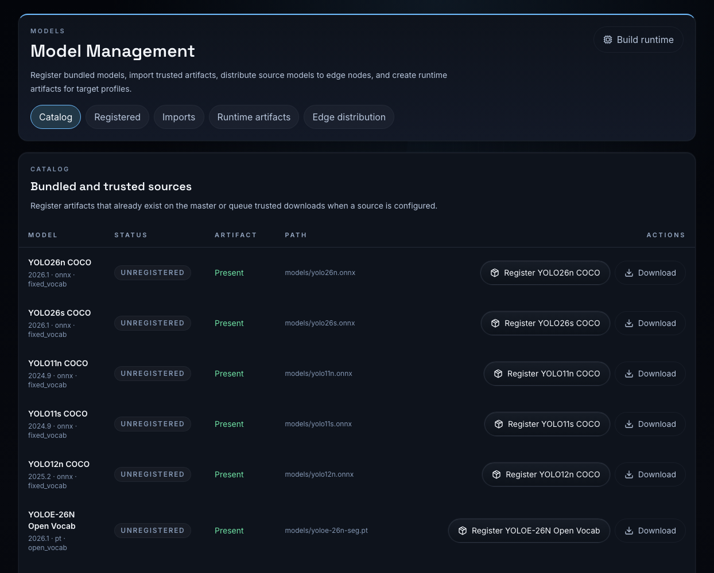
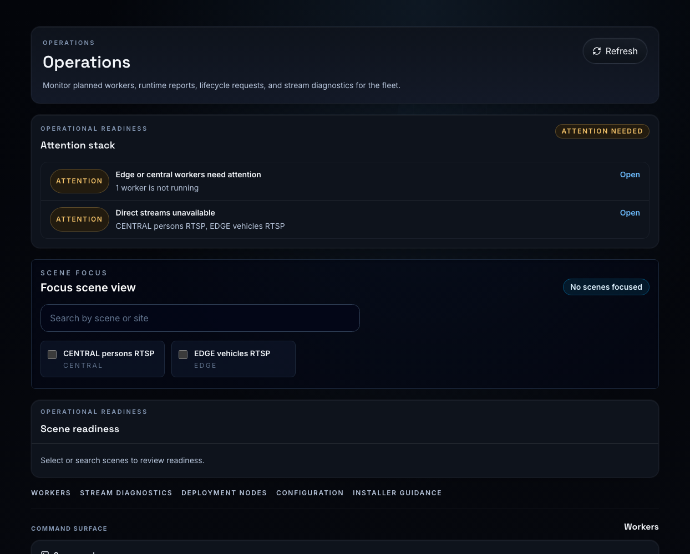
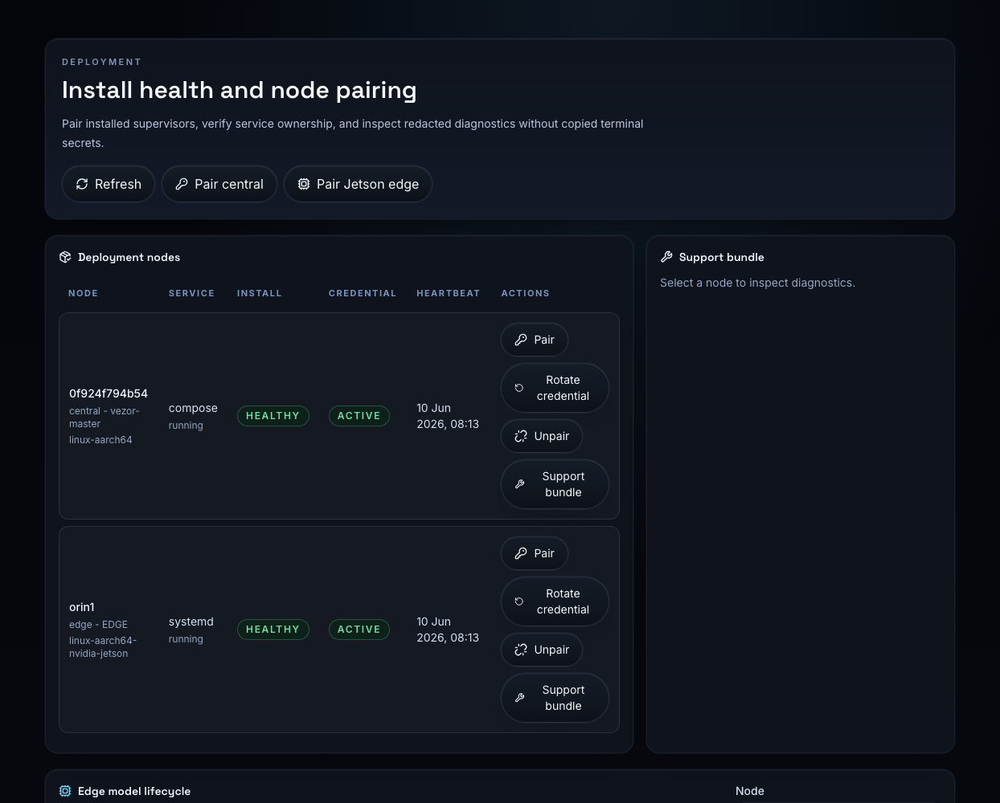
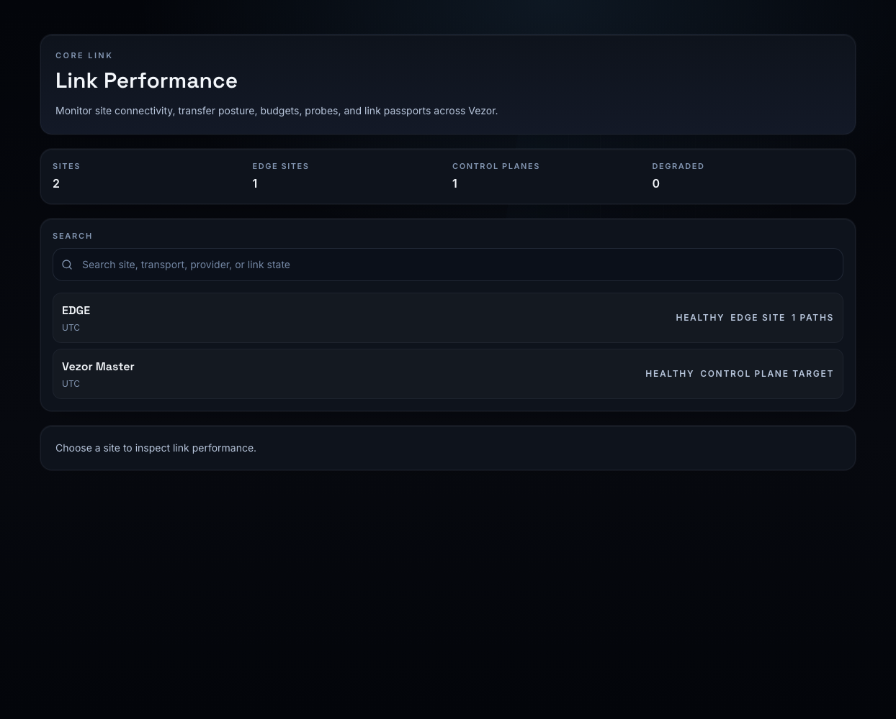
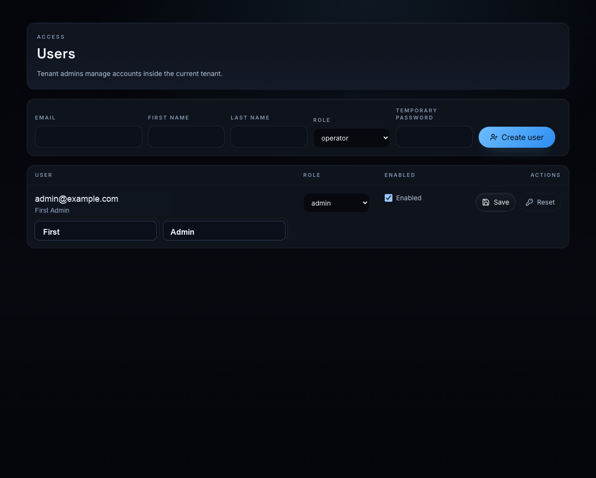

# Vezor User Guide

Date: 2026-06-10
Version: 2026.1

Vezor is an operator console for live spatial intelligence across central and
edge video analytics nodes. Use it to configure scenes, run models where they
belong, watch live signals, collect evidence, monitor links, and manage tenant
users without dropping into Keycloak or node terminals.

## Roles

Vezor has four product roles:

- `viewer`: can inspect allowed live, history, evidence, and status surfaces.
- `operator`: can operate live views and day-to-day scene workflows.
- `admin`: can manage tenant scenes, models, deployment posture, users, and
  operations inside one tenant.
- `platform superadmin`: signs in through the platform sign-in flow, sees all
  tenants, creates tenants, and creates tenant users and tenant admins.

Tenant admins are scoped to their tenant. Platform superadmins are intentionally
not tenant-scoped and should be limited to trusted platform operators.

## Sign In

Open the Vezor frontend URL provided by your installer or administrator. Use:

- **Sign in** for a normal tenant account.
- **Platform sign in** for a platform superadmin account.

If you are redirected to first-run or platform bootstrap, the system has not
finished initial identity setup. Follow the installation guide before normal
operators sign in.

## Navigation Map

- **Dashboard**: summary posture and starting point.
- **Live**: live scene wall, scene selection, live signals, and Ask Vezor.
- **Patterns**: historical detections, tracks, and spatial patterns.
- **Evidence**: incident review and evidence workflow.
- **Links**: Core Link performance, site connectivity, probes, and samples.
- **Deployment**: install health, central/edge pairing, credentials, service
  reports, and support bundles.
- **Models**: model catalog, registration, imports, runtime artifacts, and edge
  distribution.
- **Sites**: physical site inventory.
- **Users**: tenant user management, plus tenant creation for platform
  superadmins.
- **Scenes**: camera and scene setup.
- **Operations**: readiness, worker lifecycle, stream diagnostics, deployment
  node state, and installer guidance.
- **FleetOps**: optional pack workspace when maritime/fleet features are
  enabled.

## Live



Use **Live** to select one or more scenes and open the live wall. The scene
browser lets you filter by scene or site. The portal grid shows selected
scenes, and the signal panel summarizes active live signals.

Use **Ask Vezor** for operator intent such as "show people near restricted
zones". The resolved intent is selection-aware and applies to the current live
view.

Live video renditions depend on scene and worker readiness:

- **Native clean** is passthrough delivery.
- **Annotated source** is worker-published processed video.
- **Processed custom** uses a reduced profile such as 720p or a capped frame
  rate for lower bandwidth viewing.

If a scene has no visible stream, open Operations and inspect stream diagnostics
before changing the scene configuration.

## Scenes



Use **Scenes** to add or update cameras. The guided setup has five steps:

1. **Source**: scene name, site, processing mode, and source stream.
2. **Model**: primary model, runtime artifact selection, class scope, and
   tracker.
3. **Privacy**: privacy profile and output behavior.
4. **Boundaries**: include zones, exclusion zones, and event boundaries.
5. **Calibration**: perspective and physical scene context.

When editing an existing scene, Vezor does not expose the stored RTSP URI back
to the browser. To change a camera source, paste the new URI in the source step.
Use placeholders in documentation and tickets, for example:

```text
rtsp://<username>:<password>@CAMERA_HOST:8554/ch1
```

Scene readiness is strict. A scene can show **Needs setup** or **Needs
attention** when the model is not registered, the runtime artifact is not synced
to the edge node, the worker is not running, or stream probing fails.

## Models



Use **Models** to move from source models to runtime-ready deployment:

- **Catalog** lists bundled or trusted model sources and whether the artifact is
  present on the master.
- **Registered** shows model rows available for scene assignment.
- **Imports** queues trusted model imports.
- **Runtime artifacts** builds or registers target-specific outputs, including
  TensorRT engines for Jetson.
- **Edge distribution** syncs source models and runtime artifacts to edge nodes.

For Jetson scenes that should use TensorRT, first register a portable source
model row, then build a TensorRT runtime artifact on the Jetson target. Do not
copy a TensorRT `.engine` from another machine; engines are tied to the target
hardware, JetPack, TensorRT, CUDA, and driver stack.

## Operations



Use **Operations** as the exception-first runtime surface. The attention stack
groups problems that block live operation:

- workers not running
- direct streams unavailable
- model or runtime artifact mismatch
- stale supervisor heartbeat
- stream diagnostics failures
- deployment node or credential issues

Select one or more scenes in **Focus scene view** to inspect readiness,
workers, stream diagnostics, deployment nodes, configuration, and installer
guidance. A healthy deployment should not rely on foreground terminals or
pasted bearer tokens. Installed central and edge supervisors own worker start,
restart, monitoring, and service reports.

## Deployment



Use **Deployment** for install health and node pairing:

- Refresh install posture.
- Pair the central supervisor when needed.
- Create a one-time Jetson edge pairing session.
- Rotate node credentials.
- Unpair a node.
- Generate support bundles with redacted diagnostics.

Support bundles are for operational evidence. Review them before sharing and do
not add raw secrets or camera credentials to tickets.

## Link Performance



Use **Links** to monitor site connectivity and Core Link posture. Edge sites
can own link paths, monitoring targets, budgets, queues, and manual samples.
The Vezor master is shown as a control-plane target and optional UDP reflector.

Installed edge nodes include an edge-agent service configuration. Operators can
run manual probes from the edge vantage point, including UDP sequence probes
against the authenticated master reflector. Throughput checks are manual
operator actions and are not run continuously.

The **active connection** field is not a generic speed test result. Use it as
inventory and connection context. For actual throughput, use the explicit
throughput sample action backed by the installed edge-agent payload file.

## Users



Tenant admins can create and update users inside their current tenant:

1. Open **Users**.
2. Enter email, first name, last name, role, and a temporary password.
3. Choose `viewer`, `operator`, or `admin`.
4. Click **Create user**.
5. Give the temporary password to the user through your approved secret-sharing
   channel.

Tenant admins cannot create platform superadmins and cannot create users in
other tenants.

Platform superadmins use **Platform sign in**. In Users, they can create
tenants, list all tenants, create tenant users, create tenant admins, update
users across tenants, disable users, and reset temporary passwords.

For the first platform superadmin, use the one-time `/platform-bootstrap` flow
from the full installation guide. Do not create the first platform superadmin
directly in Keycloak unless you are performing documented break-glass recovery.

## Evidence And Patterns

Use **Evidence** to review incidents, snapshots, clips, and rule-triggered
events. Evidence policy determines retention, storage scope, and privacy
handling.

Use **Patterns** to inspect historical detections and trends. Patterns are most
useful after workers have produced stable tracks for a period of time.

## Good Operating Habits

- Treat **Needs attention** as unresolved until Operations explains the cause.
- Keep model registration, edge distribution, TensorRT builds, and scene
  runtime choice in the UI.
- Use Deployment support bundles instead of copying terminal logs by hand.
- Never paste raw RTSP credentials, tokens, bootstrap codes, node credentials,
  or reflector secrets into tickets or documentation.
- Run a fresh smoke after destructive reset, credential rotation, image rebuild,
  or Jetson package changes.
